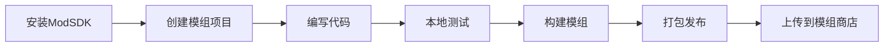

### 5. 对象工厂系统（替代Prefab）

```csharp
// ModSystem.Core/Runtime/ObjectFactory.cs
using System;
using System.Collections.Generic;
using System.Threading.Tasks;
using UnityEngine;
using Newtonsoft.Json;

namespace ModSystem.Core
{
    /// <summary>
    /// 对象定义
    /// </summary>
    [Serializable]
    public class ObjectDefinition
    {
        public string objectId { get; set; }
        public string name { get; set; }
        public List<ComponentDefinition> components { get; set; }
    }
    
    /// <summary>
    /// 组件定义
    /// </summary>
    [Serializable]
    public class ComponentDefinition
    {
        public string type { get; set; }
        public Dictionary<string, object> properties { get; set; }
        
        // 便捷属性访问
        public T GetProperty<T>(string key, T defaultValue = default)
        {
            if (properties != null && properties.TryGetValue(key, out var value))
            {
                try
                {
                    return (T)Convert.ChangeType(value, typeof(T));
                }
                catch
                {
                    return defaultValue;
                }
            }
            return defaultValue;
        }
    }
    
    /// <summary>
    /// 运行时对象工厂，替代prefab系统
    /// </summary>
    public class ModObjectFactory
    {
        private readonly Dictionary<string, ObjectDefinition> definitionCache;
        
        public ModObjectFactory()
        {
            definitionCache = new Dictionary<string, ObjectDefinition>();
        }
        
        /// <summary>
        /// 从JSON文件创建对象
        /// </summary>
        public async Task<GameObject> CreateObjectAsync(string definitionPath)
        {
            // 加载对象定义
            ObjectDefinition definition;
            
            if (definitionCache.ContainsKey(definitionPath))
            {
                definition = definitionCache[definitionPath];
            }
            else
            {
                var json = await LoadJsonAsync(definitionPath);
                definition = JsonConvert.DeserializeObject<ObjectDefinition>(json);
                definitionCache[definitionPath] = definition;
            }
            
            // 创建GameObject
            var gameObject = new GameObject(definition.name);
            
            // 添加组件
            foreach (var compDef in definition.components)
            {
                await AddComponentAsync(gameObject, compDef);
            }
            
            return gameObject;
        }
        
        private async Task AddComponentAsync(GameObject obj, ComponentDefinition compDef)
        {
            switch (compDef.type)
            {
                case "Transform":
                    ConfigureTransform(obj.transform, compDef);
                    break;
                    
                case "MeshRenderer":
                    await ConfigureMeshRenderer(obj, compDef);
                    break;
                    
                case "BoxCollider":
                    ConfigureBoxCollider(obj, compDef);
                    break;
                    
                case "SphereCollider":
                    ConfigureSphereCollider(obj, compDef);
                    break;
                    
                case "ModBehaviour":
                    ConfigureModBehaviour(obj, compDef);
                    break;
                    
                case "RigidBody":
                    ConfigureRigidBody(obj, compDef);
                    break;
                    
                default:
                    Debug.LogWarning($"Unknown component type: {compDef.type}");
                    break;
            }
        }
        
        private void ConfigureTransform(Transform transform, ComponentDefinition compDef)
        {
            var position = compDef.GetProperty<float[]>("position", new float[] { 0, 0, 0 });
            var rotation = compDef.GetProperty<float[]>("rotation", new float[] { 0, 0, 0 });
            var scale = compDef.GetProperty<float[]>("scale", new float[] { 1, 1, 1 });
            
            transform.position = new Vector3(position[0], position[1], position[2]);
            transform.rotation = Quaternion.Euler(rotation[0], rotation[1], rotation[2]);
            transform.localScale = new Vector3(scale[0], scale[1], scale[2]);
        }
        
        private async Task ConfigureMeshRenderer(GameObject obj, ComponentDefinition compDef)
        {
            var modelPath = compDef.GetProperty<string>("model");
            if (!string.IsNullOrEmpty(modelPath))
            {
                // 加载glTF模型
                await LoadGLTFModel(obj, modelPath);
            }
            
            var renderer = obj.GetComponent<MeshRenderer>();
            if (renderer != null)
            {
                // 配置材质
                var materialDef = compDef.GetProperty<Dictionary<string, object>>("material");
                if (materialDef != null)
                {
                    ConfigureMaterial(renderer, materialDef);
                }
            }
        }
        
        private void ConfigureBoxCollider(GameObject obj, ComponentDefinition compDef)
        {
            var collider = obj.AddComponent<BoxCollider>();
            
            var center = compDef.GetProperty<float[]>("center", new float[] { 0, 0, 0 });
            var size = compDef.GetProperty<float[]>("size", new float[] { 1, 1, 1 });
            var isTrigger = compDef.GetProperty<bool>("isTrigger", false);
            
            collider.center = new Vector3(center[0], center[1], center[2]);
            collider.size = new Vector3(size[0], size[1], size[2]);
            collider.isTrigger = isTrigger;
        }
        
        private void ConfigureSphereCollider(GameObject obj, ComponentDefinition compDef)
        {
            var collider = obj.AddComponent<SphereCollider>();
            
            var center = compDef.GetProperty<float[]>("center", new float[] { 0, 0, 0 });
            var radius = compDef.GetProperty<float>("radius", 0.5f);
            var isTrigger = compDef.GetProperty<bool>("isTrigger", false);
            
            collider.center = new Vector3(center[0], center[1], center[2]);
            collider.radius = radius;
            collider.isTrigger = isTrigger;
        }
        
        private void ConfigureRigidBody(GameObject obj, ComponentDefinition compDef)
        {
            var rb = obj.AddComponent<Rigidbody>();
            
            rb.mass = compDef.GetProperty<float>("mass", 1f);
            rb.drag = compDef.GetProperty<float>("drag", 0f);
            rb.angularDrag = compDef.GetProperty<float>("angularDrag", 0.05f);
            rb.useGravity = compDef.GetProperty<bool>("useGravity", true);
            rb.isKinematic = compDef.GetProperty<bool>("isKinematic", false);
        }
        
        private void ConfigureModBehaviour(GameObject obj, ComponentDefinition compDef)
        {
            var behaviourClass = compDef.GetProperty<string>("behaviourClass");
            if (string.IsNullOrEmpty(behaviourClass))
            {
                Debug.LogError("ModBehaviour requires behaviourClass property");
                return;
            }
            
            // 动态加载行为类
            var behaviourType = Type.GetType(behaviourClass);
            if (behaviourType != null && typeof(IModBehaviour).IsAssignableFrom(behaviourType))
            {
                var behaviour = obj.AddComponent(behaviourType) as IModBehaviour;
                
                // 应用配置
                var config = compDef.GetProperty<Dictionary<string, object>>("config");
                if (config != null && behaviour != null)
                {
                    // 这里需要实现配置应用逻辑
                    ApplyBehaviourConfig(behaviour, config);
                }
            }
            else
            {
                Debug.LogError($"Could not find or instantiate behaviour class: {behaviourClass}");
            }
        }
        
        private void ApplyBehaviourConfig(IModBehaviour behaviour, Dictionary<string, object> config)
        {
            // 使用反射或其他机制应用配置
            // 这里是简化示例
            var type = behaviour.GetType();
            foreach (var kvp in config)
            {
                var property = type.GetProperty(kvp.Key);
                if (property != null && property.CanWrite)
                {
                    try
                    {
                        property.SetValue(behaviour, kvp.Value);
                    }
                    catch (Exception ex)
                    {
                        Debug.LogError($"Failed to set property {kvp.Key}: {ex.Message}");
                    }
                }
            }
        }
        
        private async Task LoadGLTFModel(GameObject obj, string modelPath)
        {
            // 这里应该使用实际的glTF加载库
            // 例如：GLTFUtility、UnityGLTF等
            Debug.Log($"Loading glTF model: {modelPath}");
            
            // 示例：使用GLTFUtility
            // await GLTFUtility.LoadAsync(modelPath, obj.transform);
        }
        
        private void ConfigureMaterial(MeshRenderer renderer, Dictionary<string, object> materialDef)
        {
            var material = new Material(Shader.Find("Standard"));
            
            // 设置颜色
            if (materialDef.TryGetValue("color", out var colorObj) && colorObj is float[] color)
            {
                material.color = new Color(color[0], color[1], color[2], color.Length > 3 ? color[3] : 1f);
            }
            
            // 设置金属度和光滑度
            if (materialDef.TryGetValue("metallic", out var metallic))
            {
                material.SetFloat("_Metallic", Convert.ToSingle(metallic));
            }
            
            if (materialDef.TryGetValue("smoothness", out var smoothness))
            {
                material.SetFloat("_Glossiness", Convert.ToSingle(smoothness));
            }
            
            renderer.material = material;
        }
        
        private async Task<string> LoadJsonAsync(string path)
        {
            // 实际实现应该从正确的路径加载
            // 这里是示例
            return await Task.Run(() => System.IO.File.ReadAllText(path));
        }
    }
}
```

### 6. 对象定义示例

```json
// Objects/interactive_button.json
{
  "objectId": "interactive_button_01",
  "name": "交互按钮",
  "components": [
    {
      "type": "Transform",
      "properties": {
        "position": [0, 1, 0],
        "rotation": [0, 0, 0],
        "scale": [1, 0.2, 1]
      }
    },
    {
      "type": "MeshRenderer",
      "properties": {
        "model": "Models/button.gltf",
        "material": {
          "shader": "Standard",
          "color": [1, 1, 1, 1],
          "metallic": 0.5,
          "smoothness": 0.8
        }
      }
    },
    {
      "type": "BoxCollider",
      "properties": {
        "center": [0, 0, 0],
        "size": [1, 0.2, 1],
        "isTrigger": false
      }
    },
    {
      "type": "ModBehaviour",
      "properties": {
        "behaviourClass": "ButtonMod.ButtonBehaviour",
        "config": {
          "buttonId": "btn_01",
          "buttonType": "toggle",
          "clickSound": "audio/click.wav"
        }
      }
    }
  ]
}
```

```json
// Objects/robot_arm.json
{
  "objectId": "robot_arm_01",
  "name": "机器人手臂",
  "components": [
    {
      "type": "Transform",
      "properties": {
        "position": [0, 0, 0],
        "rotation": [0, 0, 0],
        "scale": [1, 1, 1]
      }
    },
    {
      "type": "MeshRenderer",
      "properties": {
        "model": "Models/robot_base.gltf",
        "material": {
          "shader": "Standard",
          "color": [0.8, 0.8, 0.8, 1],
          "metallic": 0.7,
          "smoothness": 0.9
        }
      }
    },
    {
      "type": "ModBehaviour",
      "properties": {
        "behaviourClass": "RobotMod.RobotArmBehaviour",
        "config": {
          "robotId": "robot_01",
          "defaultSpeed": 30
        }
      }
    },
    {
      "type": "RigidBody",
      "properties": {
        "mass": 50,
        "isKinematic": true,
        "useGravity": false
      }
    }
  ]
}
```    /// <summary>
    /// 机器人配置
    /// </summary>
    [Serializable]
    public class RobotConfiguration
    {
        public string RobotId = "robot_01";
        public List<JointConfiguration> Joints = new List<JointConfiguration>();
        public bool EnableCollisionDetection = true;
        public bool EnableIK = true;
        public float DefaultSpeed = 30f;
    }
    
    /// <summary>
    /// 关节配置
    /// </summary>
    [Serializable]
    public class JointConfiguration
    {
        public string Name;
        public Vector3 RotationAxis = Vector3.up;
        public float MinAngle = -180f;
        public float MaxAngle = 180f;
        public float InitialAngle = 0f;
        public float MaxVelocity = 60f;
        public float Kp = 5f;  // PID参数
        public float Ki = 0.1f;
        public float Kd = 1f;
    }
    
    /// <summary>
    /// 运动学控制器（简化版）
    /// </summary>
    public class KinematicsController
    {
        private Dictionary<string, JointController> joints;
        private RobotConfiguration config;
        
        public KinematicsController(Dictionary<string, JointController> joints, RobotConfiguration config)
        {
            this.joints = joints;
            this.config = config;
        }
        
        public Dictionary<string, float> CalculateInverseKinematics(Vector3 targetPosition)
        {
            // 简化的IK计算，实际应该使用专业的IK算法
            var result = new Dictionary<string, float>();
            
            // 这里只是示例，实际需要根据机器人结构计算
            result["base_rotation"] = Mathf.Atan2(targetPosition.x, targetPosition.z) * Mathf.Rad2Deg;
            result["shoulder_pitch"] = 45f;
            result["elbow_pitch"] = -45f;
            
            return result;
        }
        
        public Vector3 GetEndEffectorPosition()
        {
            // 简化计算，实际需要正向运动学
            return new Vector3(0, 1, 1);
        }
    }
    
    private ButtonConfiguration LoadConfiguration()
    {
        // 加载配置的实现
        return new ButtonConfiguration();
    }
    
    private RobotConfiguration LoadConfiguration()
    {
        // 加载配置的实现
        return new RobotConfiguration();
    }
    
    private void CheckCollisions()
    {
        // 碰撞检测实现
    }
    
    private void HandleRotateJoint(Dictionary<string, object> parameters)
    {
        // 处理关节旋转
    }
    
    private void MoveToHomePosition()
    {
        // 移动到初始位置
    }
    
    private void ExecuteSequence(Dictionary<string, object> parameters)
    {
        // 执行动作序列
    }
    
    private void ShowSuccessFeedback()
    {
        // 显示成功反馈
    }
    
    private void ShowErrorFeedback()
    {
        // 显示错误反馈
    }
    
    private void ShowTimeoutFeedback()
    {
        // 显示超时反馈
    }
    
    private void CallButtonService()
    {
        // 调用按钮服务
    }
    
    private void ExecuteConfiguredActions()
    {
        // 执行配置的动作
    }
    
    private void OnButtonRelease()
    {
        // 按钮释放处理
    }
    
    private void AnimateRelease()
    {
        // 释放动画
    }
    
    private void OnServiceRegistered(ServiceRegisteredEvent e)
    {
        // 服务注册事件处理
    }    /// <summary>
    /// 按钮动作请求
    /// </summary>
    public class ButtonActionRequest : ModRequest
    {
        public string ButtonId { get; set; }
        public string Action { get; set; }
        public Dictionary<string, object> Parameters { get; set; }
    }
    
    /// <summary>
    /// 按钮动作响应
    /// </summary>
    public class ButtonActionResponse : ModResponse
    {
        public string ActionResult { get; set; }
    }
    
    /// <summary>
    /// 按钮状态
    /// </summary>
    public class ButtonState
    {
        public bool IsPressed { get; set; }
        public float PressedTime { get; set; }
        public int ClickCount { get; set; }
    }# Unity模组通信系统 - 完整实现与文档

## 目录
1. [系统概述](#系统概述)
2. [项目结构](#项目结构)
3. [核心组件](#核心组件)
4. [通信模式](#通信模式)
5. [完整代码实现](#完整代码实现)
6. [使用示例](#使用示例)
7. [配置说明](#配置说明)
8. [最佳实践](#最佳实践)
9. [安装和部署](#安装和部署)
10. [独立模组开发（无需Unity）](#独立模组开发)

## 系统概述

本通信系统提供了多种模组间通信方式，以满足不同场景的需求：

- **事件系统**：适用于简单的单向通知
- **请求-响应模式**：适用于需要返回结果的操作
- **服务注册模式**：适用于模组间的紧密协作
- **配置驱动**：通过配置文件定义通信关系

## 项目结构

本系统分为两个主要部分：
1. **Unity主项目** - 包含模组系统核心和运行时
2. **独立开发SDK** - 用于无Unity编辑器的模组开发

### 完整的项目目录结构

```
UnityProject/                              # Unity主项目
├── Assets/
│   ├── ModSystem/                          # 模组系统核心
│   │   ├── Core/                          # 核心框架（所有模组共享）
│   │   │   ├── Interfaces/                # 接口定义
│   │   │   │   ├── IModEvent.cs
│   │   │   │   ├── IModBehaviour.cs
│   │   │   │   ├── IModContext.cs
│   │   │   │   ├── IEventBus.cs
│   │   │   │   ├── IModService.cs
│   │   │   │   └── IServiceRegistry.cs
│   │   │   │
│   │   │   ├── EventSystem/               # 事件系统实现
│   │   │   │   ├── ModEventBus.cs
│   │   │   │   ├── EventLogger.cs
│   │   │   │   └── EventMonitor.cs
│   │   │   │
│   │   │   ├── Communication/             # 通信系统
│   │   │   │   ├── RequestResponse.cs
│   │   │   │   ├── RequestResponseManager.cs
│   │   │   │   ├── CommunicationRouter.cs
│   │   │   │   └── CommunicationConfig.cs
│   │   │   │
│   │   │   ├── Services/                  # 服务系统
│   │   │   │   ├── ModServiceRegistry.cs
│   │   │   │   └── ServiceEvents.cs
│   │   │   │
│   │   │   ├── Runtime/                   # 运行时组件
│   │   │   │   ├── ModManager.cs
│   │   │   │   ├── ModLoader.cs
│   │   │   │   ├── ModContext.cs
│   │   │   │   ├── ModAPI.cs
│   │   │   │   └── ObjectFactory.cs      # 对象工厂（替代prefab）
│   │   │   │
│   │   │   └── ModSystem.Core.asmdef      # 程序集定义文件
│   │   │
│   │   └── Examples/                      # 示例项目
│   │       ├── ButtonMod/
│   │       ├── RobotMod/
│   │       └── SensorMod/
│   │
│   ├── StreamingAssets/                   # 运行时加载的资源
│   │   ├── ModConfigs/                    # 模组配置文件
│   │   │   └── communication_config.json  # 通信配置
│   │   │
│   │   ├── Mods/                          # 开发中的模组（可选）
│   │   │   ├── ButtonMod/
│   │   │   └── RobotMod/
│   │   │
│   │   └── ModPackages/                   # 打包的模组文件
│   │       ├── button_mod_v1.0.modpack
│   │       └── robot_mod_v2.0.modpack
│   │
│   └── Scenes/
│       ├── ModSystemDemo.unity            # 演示场景
│       └── ModTestEnvironment.unity       # 测试环境
│
├── Packages/                              # Unity包管理器
│   └── manifest.json                      # 包依赖配置
│
└── ProjectSettings/                       # Unity项目设置

ModSDK/                                    # 独立开发SDK（不在Unity项目中）
├── SDK/
│   ├── ModSDK.Core.dll                   # 核心接口库
│   ├── ModSDK.Runtime.dll                # 运行时支持库
│   ├── UnityEngine.CoreModule.dll        # Unity运行时（精简版）
│   └── Newtonsoft.Json.dll               # JSON支持
│
├── Tools/
│   ├── ModBuilder.exe                    # 命令行构建工具
│   ├── ModEditor.exe                     # 可视化编辑器
│   └── ModPackager.exe                   # 打包工具
│
├── Templates/                             # 项目模板
│   ├── ButtonMod/
│   ├── RobotMod/
│   └── EmptyMod/
│
└── Documentation/                         # SDK文档

用户模组项目/                              # 用户创建的模组（独立目录）
├── Source/                                # C#源代码
├── Objects/                               # 对象定义（JSON）
├── Models/                                # 3D模型（glTF）
├── Config/                                # 配置文件
├── Resources/                             # 其他资源
├── SDK/                                   # SDK副本
├── [ModName].csproj                      # 项目文件
└── manifest.json                          # 模组清单
```

### 文件组织说明

#### 1. 核心系统文件（ModSystem/Core/）

这是所有模组共享的核心框架，应该编译成独立的DLL供模组引用：

**接口定义（Interfaces/）**
- `IModEvent.cs` - 所有事件的基础接口
- `IModBehaviour.cs` - 模组行为的基础接口
- `IModContext.cs` - 模组上下文接口
- `IEventBus.cs` - 事件总线接口
- `IModService.cs` - 服务基础接口
- `IServiceRegistry.cs` - 服务注册表接口

**事件系统（EventSystem/）**
- `ModEventBus.cs` - 事件总线的具体实现
- `EventLogger.cs` - 事件日志记录器
- `EventMonitor.cs` - 事件监控UI组件

**通信系统（Communication/）**
- `RequestResponse.cs` - 请求响应基类定义
- `RequestResponseManager.cs` - 请求响应管理器
- `CommunicationRouter.cs` - 配置驱动的通信路由器
- `CommunicationConfig.cs` - 通信配置数据结构

**服务系统（Services/）**
- `ModServiceRegistry.cs` - 服务注册表实现
- `ServiceEvents.cs` - 服务相关事件定义

**运行时组件（Runtime/）**
- `ModManager.cs` - 模组管理器主类
- `ModLoader.cs` - 模组加载器
- `ModContext.cs` - 模组上下文实现
- `ModAPI.cs` - 提供给模组的API实现
- `ObjectFactory.cs` - 运行时对象工厂（替代prefab系统）

#### 2. 模组文件（Mods/）

每个模组都是独立的文件夹，包含自己的代码、资源和配置：

**按钮模组（ButtonMod/）**
```
ButtonMod/
├── Scripts/
│   ├── ButtonBehaviour.cs        # 主行为脚本
│   ├── ButtonConfiguration.cs    # 配置数据结构
│   └── ButtonEvents.cs          # 按钮相关事件定义
├── Objects/                     # 对象定义（替代prefab）
│   ├── interactive_button.json
│   └── toggle_button.json
├── Models/                      # 3D模型文件
│   └── button.gltf
├── Config/                      # 配置文件
│   └── config.json
├── Resources/                   # 其他资源
│   ├── Textures/
│   └── Audio/
├── ButtonMod.asmdef            # 程序集定义
└── manifest.json               # 模组清单
```

**机器人模组（RobotMod/）**
```
RobotMod/
├── Scripts/
│   ├── RobotArmBehaviour.cs    # 主行为脚本
│   ├── JointController.cs      # 关节控制器
│   ├── KinematicsController.cs # 运动学控制器
│   ├── RobotConfiguration.cs   # 配置数据结构
│   ├── RobotService.cs         # 服务接口实现
│   └── RobotEvents.cs          # 机器人相关事件
├── Objects/                    # 对象定义
│   └── robot_arm.json
├── Models/                     # 3D模型文件
│   ├── robot_base.gltf
│   ├── robot_arm.gltf
│   └── robot_gripper.gltf
├── Config/                     # 配置文件
│   └── config.json
├── RobotMod.asmdef            # 程序集定义
└── manifest.json              # 模组清单
```

#### 3. 程序集定义文件（.asmdef）

**ModSystem.Core.asmdef**
```json
{
    "name": "ModSystem.Core",
    "rootNamespace": "ModSystem.Core",
    "references": [
        "Unity.TextMeshPro"
    ],
    "includePlatforms": [],
    "excludePlatforms": [],
    "allowUnsafeCode": false,
    "overrideReferences": false,
    "precompiledReferences": [],
    "autoReferenced": true,
    "defineConstraints": [],
    "versionDefines": [],
    "noEngineReferences": false
}
```

**ButtonMod.asmdef**
```json
{
    "name": "ButtonMod",
    "rootNamespace": "ButtonMod",
    "references": [
        "ModSystem.Core"
    ],
    "includePlatforms": [],
    "excludePlatforms": [],
    "allowUnsafeCode": false,
    "overrideReferences": false,
    "precompiledReferences": [],
    "autoReferenced": false,
    "defineConstraints": [],
    "versionDefines": [],
    "noEngineReferences": false
}
```

**RobotMod.asmdef**
```json
{
    "name": "RobotMod",
    "rootNamespace": "RobotMod",
    "references": [
        "ModSystem.Core"
    ],
    "includePlatforms": [],
    "excludePlatforms": [],
    "allowUnsafeCode": false,
    "overrideReferences": false,
    "precompiledReferences": [],
    "autoReferenced": false,
    "defineConstraints": [],
    "versionDefines": [],
    "noEngineReferences": false
}
```

#### 4. 模组清单文件（manifest.json）

**按钮模组清单**
```json
{
    "id": "button_mod",
    "name": "Interactive Button Module",
    "version": "1.0.0",
    "author": "ModDeveloper",
    "description": "Provides interactive button functionality",
    "unityVersion": "2021.3.0f1",
    "dependencies": [
        {
            "id": "mod_system_core",
            "version": "1.0.0"
        }
    ],
    "assemblies": [
        "ButtonMod.dll"
    ],
    "scripts": [
        {
            "type": "ButtonMod.ButtonBehaviour",
            "singleton": false
        }
    ],
    "resources": {
        "models": [
            "Models/button.gltf"
        ],
        "objects": [
            "Objects/interactive_button.json",
            "Objects/toggle_button.json"
        ],
        "configs": [
            "Config/button_config.json"
        ],
        "textures": [
            "Resources/Textures/button_normal.png",
            "Resources/Textures/button_pressed.png"
        ]
    }
}
```

**机器人模组清单**
```json
{
    "id": "robot_mod",
    "name": "Robot Arm Module",
    "version": "2.0.0",
    "author": "RoboticsTeam",
    "description": "6-axis robot arm controller with IK support",
    "unityVersion": "2021.3.0f1",
    "dependencies": [
        {
            "id": "mod_system_core",
            "version": "1.0.0"
        }
    ],
    "assemblies": [
        "RobotMod.dll"
    ],
    "scripts": [
        {
            "type": "RobotMod.RobotArmBehaviour",
            "singleton": true
        }
    ],
    "services": [
        {
            "interface": "RobotMod.IRobotService",
            "implementation": "RobotMod.RobotService"
        }
    ],
    "resources": {
        "models": [
            "Models/robot_base.gltf",
            "Models/robot_arm.gltf",
            "Models/robot_gripper.gltf"
        ],
        "objects": [
            "Objects/robot_arm.json"
        ],
        "configs": [
            "Config/robot_config.json"
        ]
    }
}
```

#### 5. 配置文件位置

**通信配置（StreamingAssets/ModConfigs/communication_config.json）**
```json
{
    "routes": [
        {
            "name": "button_to_robot",
            "sourceEvent": "ButtonMod.ButtonPressedEvent",
            "conditions": [
                {
                    "property": "ButtonId",
                    "operator": "==",
                    "value": "control_button"
                }
            ],
            "actions": [
                {
                    "targetMod": "robot_mod",
                    "eventType": "RobotMod.MoveJointEvent",
                    "parameters": {
                        "jointName": "base_rotation",
                        "angle": 45
                    }
                }
            ]
        }
    ]
}
```

### 开发流程

#### 1. 创建新模组

使用ModBuilder命令行工具创建新模组：

```bash
# 方式1：交互式创建
ModBuilder

# 然后选择菜单：
# 1. 创建新模组项目
# 输入模组信息...

# 方式2：命令行参数（快速创建）
ModBuilder new my_custom_mod --type button --author "Your Name"
```

这会自动创建以下结构：
```
my_custom_mod/
├── Source/
│   └── MyCustomModBehaviour.cs
├── Objects/
│   └── interactive_button.json
├── Models/
├── Config/
│   └── config.json
├── Resources/
├── SDK/
├── MyCustomMod.csproj
├── manifest.json
└── README.md
```

#### 2. 引用核心库

在模组项目中，核心库已经自动被引用（在.csproj文件中）：

```xml
<Reference Include="ModSDK.Core">
  <HintPath>SDK\ModSDK.Core.dll</HintPath>
</Reference>
```

在代码中使用：
```csharp
using ModSDK.Core;
using UnityEngine;

namespace MyCustomMod
{
    public class MyCustomModBehaviour : IModBehaviour
    {
        // 实现接口...
    }
}
```

#### 3. 开发和测试

```bash
# 编辑代码
code my_custom_mod/  # 使用VS Code
# 或使用任何IDE/编辑器

# 构建模组
ModBuilder build

# 本地测试（如果有测试环境）
ModBuilder test
```

#### 4. 打包模组

模组开发完成后，打包为.modpack文件：

```bash
# 在模组目录中运行
ModBuilder package

# 或指定路径
ModBuilder package C:\Projects\my_custom_mod
```

这会生成：
```
my_custom_mod/
└── Package/
    └── my_custom_mod_v1.0.0.modpack
```

#### 5. 发布和分发

将.modpack文件分发给用户，用户只需将文件放入游戏的模组目录即可。

### 部署说明

#### 1. 主系统集成（Unity项目）

在Unity项目中集成模组系统：

1. 将 `ModSystem/Core/` 文件夹复制到Unity项目的 `Assets/` 目录
2. 创建 `StreamingAssets/Mods/` 文件夹用于存放模组
3. 创建 `StreamingAssets/ModPackages/` 文件夹用于存放.modpack文件
4. 在场景中创建 `ModManager` GameObject并添加相应组件

#### 2. 模组安装（用户端）

用户安装模组的步骤：

```bash
# 方式1：安装.modpack文件
1. 下载 xxx.modpack 文件
2. 将文件复制到：游戏目录/StreamingAssets/ModPackages/
3. 重启游戏或在游戏内刷新模组列表

# 方式2：手动安装（开发者模式）
1. 将模组文件夹复制到：游戏目录/StreamingAssets/Mods/
2. 确保包含manifest.json和所有必要文件
```

#### 3. 运行时加载

```csharp
public class ModSystemInitializer : MonoBehaviour
{
    void Start()
    {
        // 初始化模组系统
        var modManager = GetComponent<ModManager>();
        
        // 加载所有.modpack文件
        modManager.LoadModPackages();
        
        // 或加载特定模组
        modManager.LoadMod("ButtonMod");
        modManager.LoadMod("RobotMod");
    }
}
```

#### 4. 打包注意事项

- 确保所有资源文件都包含在输出目录中
- 对象定义文件（.json）必须设置为"Copy Always"
- 模型文件（.gltf）需要包含在Models目录中
- 配置文件放在 `StreamingAssets` 目录以便运行时访问
- 生产环境建议对模组DLL进行签名验证

### 快速参考：文件位置

| 文件类型 | 位置 | 说明 |
|---------|------|------|
| **核心接口** | `Assets/ModSystem/Core/Interfaces/` | 所有模组共享的接口定义 |
| **事件系统** | `Assets/ModSystem/Core/EventSystem/` | 事件总线实现 |
| **通信系统** | `Assets/ModSystem/Core/Communication/` | 请求响应、路由等 |
| **服务系统** | `Assets/ModSystem/Core/Services/` | 服务注册表 |
| **对象工厂** | `Assets/ModSystem/Core/Runtime/ObjectFactory.cs` | 运行时对象创建 |
| **模组代码** | `[ModName]/Source/` | 各模组的C#源代码 |
| **对象定义** | `[ModName]/Objects/` | JSON格式的对象定义 |
| **3D模型** | `[ModName]/Models/` | glTF格式的3D模型 |
| **模组配置** | `[ModName]/Config/` | 模组配置文件 |
| **通信配置** | `Assets/StreamingAssets/ModConfigs/` | 全局通信配置 |
| **模组包** | `Assets/StreamingAssets/ModPackages/` | .modpack文件 |

### 需要创建的核心文件

根据上面的代码，您需要创建以下文件：

#### 1. 核心系统文件（必须）
- `Assets/ModSystem/Core/Interfaces/IModEvent.cs`
- `Assets/ModSystem/Core/Interfaces/IModBehaviour.cs`
- `Assets/ModSystem/Core/Interfaces/IModContext.cs`
- `Assets/ModSystem/Core/Interfaces/IEventBus.cs`
- `Assets/ModSystem/Core/Interfaces/IModService.cs`
- `Assets/ModSystem/Core/Interfaces/IServiceRegistry.cs`
- `Assets/ModSystem/Core/EventSystem/ModEventBus.cs`
- `Assets/ModSystem/Core/Communication/RequestResponse.cs`
- `Assets/ModSystem/Core/Communication/RequestResponseManager.cs`
- `Assets/ModSystem/Core/Services/ModServiceRegistry.cs`
- `Assets/ModSystem/Core/Runtime/ObjectFactory.cs`
- `Assets/ModSystem/Core/ModSystem.Core.asmdef`

#### 2. 独立开发SDK（用于无Unity开发）
- `ModSDK/SDK/ModSDK.Core.dll`
- `ModSDK/Tools/ModBuilder.exe`
- `ModSDK/Templates/` （各种模组模板）

#### 3. 示例模组文件
按钮模组：
- `ButtonMod/Source/ButtonBehaviour.cs`
- `ButtonMod/Objects/interactive_button.json`
- `ButtonMod/Models/button.gltf` （可选）
- `ButtonMod/Config/button_config.json`
- `ButtonMod/manifest.json`

机器人模组：
- `RobotMod/Source/RobotArmBehaviour.cs`
- `RobotMod/Source/JointController.cs`
- `RobotMod/Objects/robot_arm.json`
- `RobotMod/Models/robot_base.gltf`
- `RobotMod/Config/robot_config.json`
- `RobotMod/manifest.json`

#### 4. 配置文件
- `Assets/StreamingAssets/ModConfigs/communication_config.json`

## 核心组件

### 1. 基础接口定义

```csharp
// ModSystem.Core/Interfaces/IModEvent.cs
namespace ModSystem.Core
{
    /// <summary>
    /// 模组事件基础接口
    /// </summary>
    public interface IModEvent
    {
        /// <summary>
        /// 事件唯一标识
        /// </summary>
        string EventId { get; }
        
        /// <summary>
        /// 发送者模组ID
        /// </summary>
        string SenderId { get; set; }
        
        /// <summary>
        /// 事件时间戳
        /// </summary>
        DateTime Timestamp { get; set; }
    }
    
    /// <summary>
    /// 事件总线接口
    /// </summary>
    public interface IEventBus
    {
        /// <summary>
        /// 订阅事件
        /// </summary>
        void Subscribe<T>(Action<T> handler) where T : IModEvent;
        
        /// <summary>
        /// 订阅事件（带过滤器）
        /// </summary>
        void Subscribe<T>(Action<T> handler, Predicate<T> filter) where T : IModEvent;
        
        /// <summary>
        /// 发布事件
        /// </summary>
        void Publish<T>(T eventData) where T : IModEvent;
        
        /// <summary>
        /// 取消订阅
        /// </summary>
        void Unsubscribe<T>(Action<T> handler) where T : IModEvent;
    }
    
    /// <summary>
    /// 模组行为接口
    /// </summary>
    public interface IModBehaviour
    {
        string BehaviourId { get; }
        string Version { get; }
        void OnInitialize(IModContext context);
        void OnUpdate(float deltaTime);
        void OnDestroy();
    }
    
    /// <summary>
    /// 模组上下文接口
    /// </summary>
    public interface IModContext
    {
        string ModId { get; }
        GameObject GameObject { get; }
        IEventBus EventBus { get; }
        IModAPI API { get; }
        IServiceRegistry Services { get; }
        T GetComponent<T>() where T : Component;
        void Log(string message);
        void LogError(string message);
    }
}
```

### 2. 事件总线实现

```csharp
// ModSystem.Core/EventSystem/ModEventBus.cs
using System;
using System.Collections.Generic;
using System.Linq;
using UnityEngine;

namespace ModSystem.Core
{
    /// <summary>
    /// 事件日志接口
    /// </summary>
    public interface IEventLogger
    {
        void LogEvent(IModEvent e);
        void LogSubscription(string eventType, string subscriber);
        void LogError(string message);
    }
    
    /// <summary>
    /// 事件总线实现
    /// </summary>
    public class ModEventBus : IEventBus
    {
        private readonly Dictionary<Type, List<EventHandler>> handlers;
        private readonly object lockObject = new object();
        private readonly IEventLogger logger;
        
        // 事件发布时的回调
        public event Action<IModEvent> OnEventPublished;
        
        private class EventHandler
        {
            public Delegate Handler { get; set; }
            public Predicate<IModEvent> Filter { get; set; }
            public string SubscriberId { get; set; }
        }
        
        public ModEventBus(IEventLogger logger = null)
        {
            handlers = new Dictionary<Type, List<EventHandler>>();
            this.logger = logger;
        }
        
        public void Subscribe<T>(Action<T> handler) where T : IModEvent
        {
            Subscribe(handler, null);
        }
        
        public void Subscribe<T>(Action<T> handler, Predicate<T> filter) where T : IModEvent
        {
            lock (lockObject)
            {
                var eventType = typeof(T);
                if (!handlers.ContainsKey(eventType))
                {
                    handlers[eventType] = new List<EventHandler>();
                }
                
                handlers[eventType].Add(new EventHandler
                {
                    Handler = handler,
                    Filter = filter != null ? e => filter((T)e) : null,
                    SubscriberId = handler.Target?.GetType().Name ?? "Anonymous"
                });
                
                logger?.LogSubscription(eventType.Name, handler.Target?.GetType().Name);
            }
        }
        
        public void Publish<T>(T eventData) where T : IModEvent
        {
            if (eventData == null) return;
            
            eventData.Timestamp = DateTime.Now;
            logger?.LogEvent(eventData);
            OnEventPublished?.Invoke(eventData);
            
            List<EventHandler> eventHandlers;
            lock (lockObject)
            {
                var eventType = typeof(T);
                if (!handlers.ContainsKey(eventType))
                    return;
                
                // 创建处理器列表的副本，避免在遍历时修改
                eventHandlers = handlers[eventType].ToList();
            }
            
            foreach (var handler in eventHandlers)
            {
                try
                {
                    // 应用过滤器
                    if (handler.Filter != null && !handler.Filter(eventData))
                        continue;
                    
                    // 调用处理器
                    ((Action<T>)handler.Handler)?.Invoke(eventData);
                }
                catch (Exception ex)
                {
                    Debug.LogError($"Error in event handler: {ex.Message}");
                    logger?.LogError($"Handler error for {typeof(T).Name}: {ex.Message}");
                }
            }
        }
        
        public void Unsubscribe<T>(Action<T> handler) where T : IModEvent
        {
            lock (lockObject)
            {
                var eventType = typeof(T);
                if (!handlers.ContainsKey(eventType))
                    return;
                
                handlers[eventType].RemoveAll(h => h.Handler.Equals(handler));
                
                if (handlers[eventType].Count == 0)
                    handlers.Remove(eventType);
            }
        }
    }
}
```

### 3. 请求-响应模式实现

```csharp
// ModSystem.Core/Communication/RequestResponse.cs
namespace ModSystem.Core
{
    /// <summary>
    /// 请求基类
    /// </summary>
    public abstract class ModRequest : IModEvent
    {
        public string EventId => GetType().Name;
        public string SenderId { get; set; }
        public DateTime Timestamp { get; set; }
        public string RequestId { get; set; } = Guid.NewGuid().ToString();
    }
    
    /// <summary>
    /// 响应基类
    /// </summary>
    public abstract class ModResponse : IModEvent
    {
        public string EventId => GetType().Name;
        public string SenderId { get; set; }
        public DateTime Timestamp { get; set; }
        public string RequestId { get; set; }
        public bool Success { get; set; }
        public string Message { get; set; }
        public object Result { get; set; }
    }
    
    /// <summary>
    /// 请求-响应通信管理器
    /// </summary>
    public class RequestResponseManager
    {
        private readonly IEventBus eventBus;
        private readonly Dictionary<string, PendingRequest> pendingRequests;
        
        private class PendingRequest
        {
            public TaskCompletionSource<ModResponse> CompletionSource { get; set; }
            public Type ResponseType { get; set; }
            public DateTime CreatedAt { get; set; }
        }
        
        public RequestResponseManager(IEventBus eventBus)
        {
            this.eventBus = eventBus;
            this.pendingRequests = new Dictionary<string, PendingRequest>();
            
            // 定期清理超时的请求
            CleanupTimeoutRequests();
        }
        
        /// <summary>
        /// 发送请求并等待响应
        /// </summary>
        public async Task<TResponse> SendRequestAsync<TRequest, TResponse>(
            TRequest request, 
            TimeSpan? timeout = null) 
            where TRequest : ModRequest 
            where TResponse : ModResponse
        {
            var actualTimeout = timeout ?? TimeSpan.FromSeconds(30);
            var tcs = new TaskCompletionSource<ModResponse>();
            
            // 注册等待响应
            pendingRequests[request.RequestId] = new PendingRequest
            {
                CompletionSource = tcs,
                ResponseType = typeof(TResponse),
                CreatedAt = DateTime.Now
            };
            
            // 订阅响应事件
            Action<TResponse> responseHandler = null;
            responseHandler = (response) =>
            {
                if (response.RequestId == request.RequestId)
                {
                    if (pendingRequests.TryGetValue(request.RequestId, out var pending))
                    {
                        pending.CompletionSource.TrySetResult(response);
                        pendingRequests.Remove(request.RequestId);
                    }
                    eventBus.Unsubscribe(responseHandler);
                }
            };
            
            eventBus.Subscribe(responseHandler);
            
            // 发布请求
            eventBus.Publish(request);
            
            // 等待响应或超时
            using (var cts = new CancellationTokenSource(actualTimeout))
            {
                try
                {
                    var completedTask = await Task.WhenAny(
                        tcs.Task,
                        Task.Delay(actualTimeout, cts.Token)
                    );
                    
                    if (completedTask == tcs.Task)
                    {
                        return (TResponse)await tcs.Task;
                    }
                    else
                    {
                        eventBus.Unsubscribe(responseHandler);
                        pendingRequests.Remove(request.RequestId);
                        throw new TimeoutException($"Request {request.RequestId} timed out");
                    }
                }
                catch (TaskCanceledException)
                {
                    throw new TimeoutException($"Request {request.RequestId} was cancelled");
                }
            }
        }
        
        private async void CleanupTimeoutRequests()
        {
            while (true)
            {
                await Task.Delay(TimeSpan.FromMinutes(1));
                
                var now = DateTime.Now;
                var timeoutRequests = pendingRequests
                    .Where(kvp => (now - kvp.Value.CreatedAt) > TimeSpan.FromMinutes(5))
                    .Select(kvp => kvp.Key)
                    .ToList();
                
                foreach (var requestId in timeoutRequests)
                {
                    if (pendingRequests.TryGetValue(requestId, out var pending))
                    {
                        pending.CompletionSource.TrySetException(
                            new TimeoutException("Request timed out during cleanup")
                        );
                        pendingRequests.Remove(requestId);
                    }
                }
            }
        }
    }
}
```

### 4. 服务注册系统

```csharp
// ModSystem.Core/Services/ServiceRegistry.cs
namespace ModSystem.Core
{
    /// <summary>
    /// 模组服务基础接口
    /// </summary>
    public interface IModService
    {
        string ServiceId { get; }
        string ProviderId { get; }
        string Version { get; }
    }
    
    /// <summary>
    /// 服务注册表接口
    /// </summary>
    public interface IServiceRegistry
    {
        void RegisterService<T>(T service) where T : class, IModService;
        T GetService<T>() where T : class, IModService;
        IEnumerable<T> GetServices<T>() where T : class, IModService;
        bool UnregisterService<T>(string serviceId) where T : class, IModService;
    }
    
    /// <summary>
    /// 服务注册表实现
    /// </summary>
    public class ModServiceRegistry : IServiceRegistry
    {
        private readonly Dictionary<Type, Dictionary<string, IModService>> services;
        private readonly IEventBus eventBus;
        
        public ModServiceRegistry(IEventBus eventBus)
        {
            this.services = new Dictionary<Type, Dictionary<string, IModService>>();
            this.eventBus = eventBus;
        }
        
        public void RegisterService<T>(T service) where T : class, IModService
        {
            var serviceType = typeof(T);
            
            if (!services.ContainsKey(serviceType))
            {
                services[serviceType] = new Dictionary<string, IModService>();
            }
            
            services[serviceType][service.ServiceId] = service;
            
            // 发布服务注册事件
            eventBus?.Publish(new ServiceRegisteredEvent
            {
                ServiceType = serviceType.Name,
                ServiceId = service.ServiceId,
                ProviderId = service.ProviderId,
                Version = service.Version
            });
            
            Debug.Log($"Service registered: {serviceType.Name} - {service.ServiceId}");
        }
        
        public T GetService<T>() where T : class, IModService
        {
            var serviceType = typeof(T);
            
            if (services.ContainsKey(serviceType) && services[serviceType].Count > 0)
            {
                return services[serviceType].Values.First() as T;
            }
            
            return null;
        }
        
        public IEnumerable<T> GetServices<T>() where T : class, IModService
        {
            var serviceType = typeof(T);
            
            if (services.ContainsKey(serviceType))
            {
                return services[serviceType].Values.Cast<T>();
            }
            
            return Enumerable.Empty<T>();
        }
        
        public bool UnregisterService<T>(string serviceId) where T : class, IModService
        {
            var serviceType = typeof(T);
            
            if (services.ContainsKey(serviceType) && 
                services[serviceType].ContainsKey(serviceId))
            {
                var service = services[serviceType][serviceId];
                services[serviceType].Remove(serviceId);
                
                // 发布服务注销事件
                eventBus?.Publish(new ServiceUnregisteredEvent
                {
                    ServiceType = serviceType.Name,
                    ServiceId = serviceId,
                    ProviderId = service.ProviderId
                });
                
                return true;
            }
            
            return false;
        }
    }
    
    /// <summary>
    /// 服务注册事件
    /// </summary>
    public class ServiceRegisteredEvent : IModEvent
    {
        public string EventId => "service_registered";
        public string SenderId { get; set; }
        public DateTime Timestamp { get; set; }
        public string ServiceType { get; set; }
        public string ServiceId { get; set; }
        public string ProviderId { get; set; }
        public string Version { get; set; }
    }
    
    /// <summary>
    /// 服务注销事件
    /// </summary>
    public class ServiceUnregisteredEvent : IModEvent
    {
        public string EventId => "service_unregistered";
        public string SenderId { get; set; }
        public DateTime Timestamp { get; set; }
        public string ServiceType { get; set; }
        public string ServiceId { get; set; }
        public string ProviderId { get; set; }
    }
}
```

## 通信模式

### 1. 事件模式（Event Pattern）

适用场景：
- 单向通知
- 广播消息
- 状态变化通知

```csharp
// 发布者
eventBus.Publish(new ButtonPressedEvent { ButtonId = "btn_1" });

// 订阅者
eventBus.Subscribe<ButtonPressedEvent>(e => {
    Debug.Log($"Button {e.ButtonId} was pressed");
});
```

### 2. 请求-响应模式（Request-Response Pattern）

适用场景：
- 需要返回结果的操作
- 需要确认的命令
- 查询操作

```csharp
// 发送请求并等待响应
var response = await requestManager.SendRequestAsync<MoveRobotRequest, MoveRobotResponse>(
    new MoveRobotRequest { TargetPosition = new Vector3(1, 2, 3) },
    TimeSpan.FromSeconds(5)
);

if (response.Success) {
    Debug.Log("Robot moved successfully");
}
```

### 3. 服务模式（Service Pattern）

适用场景：
- 模组间紧密协作
- 需要调用具体功能
- API式的交互

```csharp
// 注册服务
services.RegisterService<IRobotService>(new RobotService());

// 使用服务
var robotService = services.GetService<IRobotService>();
if (robotService != null) {
    await robotService.MoveToPosition(new Vector3(1, 2, 3));
}
```

## 完整代码实现

### 0. 基础事件和数据结构

```csharp
// ModSystem.Core/Common/CommonEvents.cs
using UnityEngine;
using System;

namespace ModSystem.Core
{
    /// <summary>
    /// 交互事件
    /// </summary>
    public class InteractionEvent : IModEvent
    {
        public string EventId => "interaction";
        public string SenderId { get; set; }
        public DateTime Timestamp { get; set; }
        
        public GameObject TargetObject { get; set; }
        public InteractionType InteractionType { get; set; }
        public Vector3 InteractionPoint { get; set; }
    }
    
    public enum InteractionType
    {
        Click,
        Press,
        Release,
        Hover,
        Exit
    }
    
    /// <summary>
    /// 紧急停止事件
    /// </summary>
    public class EmergencyStopEvent : IModEvent
    {
        public string EventId => "emergency_stop";
        public string SenderId { get; set; }
        public DateTime Timestamp { get; set; }
        public string Reason { get; set; }
    }
    
    /// <summary>
    /// 状态变更事件
    /// </summary>
    public class RobotStateChangedEvent : IModEvent
    {
        public string EventId => "robot_state_changed";
        public string SenderId { get; set; }
        public DateTime Timestamp { get; set; }
        
        public string JointName { get; set; }
        public string Status { get; set; }
        public float NewAngle { get; set; }
    }
}

// ModSystem.Core/Common/ModAPI.cs
namespace ModSystem.Core
{
    /// <summary>
    /// 模组API接口
    /// </summary>
    public interface IModAPI
    {
        IRequestResponseManager RequestResponse { get; }
        IAudioAPI Audio { get; }
        IUtilityAPI Utilities { get; }
        IObjectFactory ObjectFactory { get; }
    }
    
    /// <summary>
    /// 对象工厂接口
    /// </summary>
    public interface IObjectFactory
    {
        Task<GameObject> CreateObjectAsync(string definitionPath);
        Task<GameObject> CreateObjectFromDefinitionAsync(ObjectDefinition definition);
    }
    
    /// <summary>
    /// 请求响应管理器接口
    /// </summary>
    public interface IRequestResponseManager
    {
        Task<TResponse> SendRequestAsync<TRequest, TResponse>(TRequest request, TimeSpan? timeout = null)
            where TRequest : ModRequest
            where TResponse : ModResponse;
    }
    
    /// <summary>
    /// 音频API接口
    /// </summary>
    public interface IAudioAPI
    {
        void PlaySound(string soundId);
        void StopSound(string soundId);
    }
    
    /// <summary>
    /// 工具API接口
    /// </summary>
    public interface IUtilityAPI
    {
        void DelayCall(float delay, Action callback);
        Coroutine StartCoroutine(IEnumerator coroutine);
        void StopCoroutine(Coroutine coroutine);
    }
}
```

### 1. 按钮模组实现

```csharp
// ButtonMod/ButtonBehaviour.cs
using UnityEngine;
using ModSystem.Core;
using System;
using System.Collections.Generic;

namespace ButtonMod
{
    /// <summary>
    /// 按钮按下事件
    /// </summary>
    public class ButtonPressedEvent : IModEvent
    {
        public string EventId => "button_pressed";
        public string SenderId { get; set; }
        public DateTime Timestamp { get; set; }
        
        public string ButtonId { get; set; }
        public string ButtonType { get; set; }
        public Dictionary<string, object> Parameters { get; set; }
    }
    
    /// <summary>
    /// 按钮动作请求
    /// </summary>
    public class ButtonActionRequest : ModRequest
    {
        public string ButtonId { get; set; }
        public string Action { get; set; }
        public Dictionary<string, object> Parameters { get; set; }
    }
    
    /// <summary>
    /// 按钮动作响应
    /// </summary>
    public class ButtonActionResponse : ModResponse
    {
        public string ActionResult { get; set; }
    }
    
    /// <summary>
    /// 按钮状态
    /// </summary>
    public class ButtonState
    {
        public bool IsPressed { get; set; }
        public float PressedTime { get; set; }
        public int ClickCount { get; set; }
    }
    
    /// <summary>
    /// 按钮模组主行为
    /// </summary>
    public class ButtonBehaviour : IModBehaviour
    {
        public string BehaviourId => "interactive_button";
        public string Version => "1.0.0";
        
        private IModContext context;
        private ButtonConfiguration config;
        private ButtonState state;
        private float lastPressTime;
        
        public void OnInitialize(IModContext context)
        {
            this.context = context;
            
            // 加载配置
            config = LoadConfiguration();
            state = new ButtonState();
            
            // 设置交互组件
            SetupInteraction();
            
            // 订阅交互事件
            context.EventBus.Subscribe<InteractionEvent>(OnInteraction);
            
            // 如果配置了服务模式，等待目标服务注册
            if (config.UseServiceMode)
            {
                context.EventBus.Subscribe<ServiceRegisteredEvent>(OnServiceRegistered);
            }
            
            context.Log($"Button {config.ButtonId} initialized");
        }
        
        private void SetupInteraction()
        {
            // 添加碰撞器
            var collider = context.GameObject.GetComponent<Collider>();
            if (collider == null)
            {
                collider = context.GameObject.AddComponent<BoxCollider>();
            }
            
            // 设置为可交互层
            context.GameObject.layer = LayerMask.NameToLayer("Interactable");
            
            // 添加视觉组件
            var renderer = context.GetComponent<Renderer>();
            if (renderer != null)
            {
                renderer.material.color = config.NormalColor;
            }
        }
        
        private void OnInteraction(InteractionEvent e)
        {
            if (e.TargetObject != context.GameObject)
                return;
            
            if (e.InteractionType == InteractionType.Click)
            {
                OnButtonPress();
            }
            else if (e.InteractionType == InteractionType.Release)
            {
                OnButtonRelease();
            }
        }
        
        private void OnButtonPress()
        {
            // 检查冷却时间
            if (Time.time - lastPressTime < config.CooldownTime)
                return;
            
            lastPressTime = Time.time;
            state.IsPressed = true;
            
            // 视觉反馈
            AnimatePress();
            
            // 根据配置的通信模式处理
            switch (config.CommunicationMode)
            {
                case CommunicationMode.Event:
                    PublishButtonEvent();
                    break;
                    
                case CommunicationMode.RequestResponse:
                    SendButtonRequest();
                    break;
                    
                case CommunicationMode.Service:
                    CallButtonService();
                    break;
                    
                case CommunicationMode.Configured:
                    ExecuteConfiguredActions();
                    break;
            }
            
            // 播放音效
            if (!string.IsNullOrEmpty(config.ClickSound))
            {
                context.API.Audio.PlaySound(config.ClickSound);
            }
        }
        
        private void PublishButtonEvent()
        {
            var buttonEvent = new ButtonPressedEvent
            {
                SenderId = BehaviourId,
                ButtonId = config.ButtonId,
                ButtonType = config.ButtonType.ToString(),
                Parameters = config.EventParameters
            };
            
            context.EventBus.Publish(buttonEvent);
            context.Log($"Published button event: {config.ButtonId}");
        }
        
        private async void SendButtonRequest()
        {
            try
            {
                var request = new ButtonActionRequest
                {
                    SenderId = BehaviourId,
                    ButtonId = config.ButtonId,
                    Action = config.RequestAction,
                    Parameters = config.EventParameters
                };
                
                var response = await context.API.RequestResponse.SendRequestAsync<
                    ButtonActionRequest, 
                    ButtonActionResponse>(request, TimeSpan.FromSeconds(5));
                
                if (response.Success)
                {
                    ShowSuccessFeedback();
                    context.Log($"Button action successful: {response.Message}");
                }
                else
                {
                    ShowErrorFeedback();
                    context.LogError($"Button action failed: {response.Message}");
                }
            }
            catch (TimeoutException)
            {
                ShowTimeoutFeedback();
                context.LogError("Button action timed out");
            }
        }
        
        private void AnimatePress()
        {
            var transform = context.GameObject.transform;
            var renderer = context.GetComponent<Renderer>();
            
            // 按下动画
            transform.localPosition += Vector3.down * config.PressDepth;
            
            // 改变颜色
            if (renderer != null)
            {
                renderer.material.color = config.PressedColor;
            }
        }
        
        public void OnUpdate(float deltaTime)
        {
            // 处理按钮状态
            if (state.IsPressed && config.ButtonType == ButtonType.Momentary)
            {
                state.PressedTime += deltaTime;
                if (state.PressedTime >= config.MomentaryDuration)
                {
                    OnButtonRelease();
                }
            }
        }
        
        public void OnDestroy()
        {
            // 清理资源
            context.Log($"Button {config.ButtonId} destroyed");
        }
        
        private ButtonConfiguration LoadConfiguration()
        {
            // 实际应该从文件加载，这里返回默认配置
            return new ButtonConfiguration();
        }
        
        private void ShowSuccessFeedback()
        {
            var renderer = context.GetComponent<Renderer>();
            if (renderer != null)
            {
                renderer.material.color = Color.green;
            }
        }
        
        private void ShowErrorFeedback()
        {
            var renderer = context.GetComponent<Renderer>();
            if (renderer != null)
            {
                renderer.material.color = Color.red;
            }
        }
        
        private void ShowTimeoutFeedback()
        {
            var renderer = context.GetComponent<Renderer>();
            if (renderer != null)
            {
                renderer.material.color = Color.yellow;
            }
        }
        
        private void CallButtonService()
        {
            // 服务调用实现
            context.Log("Service mode not implemented in this example");
        }
        
        private void ExecuteConfiguredActions()
        {
            // 执行配置的动作
            PublishButtonEvent();
        }
        
        private void OnButtonRelease()
        {
            state.IsPressed = false;
            AnimateRelease();
        }
        
        private void AnimateRelease()
        {
            var transform = context.GameObject.transform;
            var renderer = context.GetComponent<Renderer>();
            
            // 释放动画
            transform.localPosition -= Vector3.down * config.PressDepth;
            
            // 恢复颜色
            if (renderer != null)
            {
                renderer.material.color = config.NormalColor;
            }
        }
        
        private void OnServiceRegistered(ServiceRegisteredEvent e)
        {
            if (e.ServiceType == config.TargetServiceType)
            {
                context.Log($"Target service {e.ServiceType} registered");
            }
        }
    }
    
    /// <summary>
    /// 按钮配置
    /// </summary>
    [System.Serializable]
    public class ButtonConfiguration
    {
        public string ButtonId = "button_01";
        public ButtonType ButtonType = ButtonType.Momentary;
        public CommunicationMode CommunicationMode = CommunicationMode.Event;
        
        // 视觉配置
        public Color NormalColor = Color.white;
        public Color PressedColor = Color.green;
        public float PressDepth = 0.02f;
        
        // 行为配置
        public float CooldownTime = 0.5f;
        public float MomentaryDuration = 0.2f;
        
        // 通信配置
        public Dictionary<string, object> EventParameters = new Dictionary<string, object>();
        public string RequestAction = "button_action";
        public bool UseServiceMode = false;
        public string TargetServiceType = "IRobotService";
        
        // 音效配置
        public string ClickSound = "button_click";
    }
    
    public enum ButtonType
    {
        Momentary,  // 瞬时按钮
        Toggle,     // 切换按钮
        Hold        // 按住按钮
    }
    
    public enum CommunicationMode
    {
        Event,              // 事件模式
        RequestResponse,    // 请求响应模式
        Service,           // 服务调用模式
        Configured         // 配置驱动模式
    }
}
```

### 2. 机器人模组实现

```csharp
// RobotMod/RobotArmBehaviour.cs
using UnityEngine;
using ModSystem.Core;
using System;
using System.Collections.Generic;
using System.Linq;
using System.Threading.Tasks;

namespace RobotMod
{
    /// <summary>
    /// 机器人服务接口
    /// </summary>
    public interface IRobotService : IModService
    {
        Task<bool> MoveJoint(string jointName, float angle, float speed = 30f);
        Task<bool> MoveToPosition(Vector3 position);
        Task<Vector3> GetEndEffectorPosition();
        Task<RobotStatus> GetStatus();
        void EmergencyStop();
    }
    
    /// <summary>
    /// 机器人状态
    /// </summary>
    public class RobotStatus
    {
        public Dictionary<string, float> JointAngles { get; set; }
        public Vector3 EndEffectorPosition { get; set; }
        public bool IsMoving { get; set; }
        public string CurrentState { get; set; }
    }
    
    /// <summary>
    /// 机器人控制请求
    /// </summary>
    public class RobotControlRequest : ModRequest
    {
        public string Command { get; set; }
        public Dictionary<string, object> Parameters { get; set; }
    }
    
    /// <summary>
    /// 机器人控制响应
    /// </summary>
    public class RobotControlResponse : ModResponse
    {
        public RobotStatus Status { get; set; }
    }
    
    /// <summary>
    /// 机器人手臂主行为
    /// </summary>
    public class RobotArmBehaviour : IModBehaviour, IRobotService
    {
        public string BehaviourId => "robot_arm_controller";
        public string Version => "2.0.0";
        
        // IRobotService 实现
        public string ServiceId => "robot_arm_service";
        public string ProviderId => "RobotMod";
        string IModService.Version => Version;
        
        private IModContext context;
        private RobotConfiguration config;
        private Dictionary<string, JointController> joints;
        private KinematicsController kinematics;
        private bool emergencyStop = false;
        
        public void OnInitialize(IModContext context)
        {
            this.context = context;
            
            // 加载配置
            config = LoadConfiguration();
            
            // 初始化关节
            InitializeJoints();
            
            // 初始化运动学控制器
            kinematics = new KinematicsController(joints, config);
            
            // 注册服务
            context.Services.RegisterService<IRobotService>(this);
            
            // 订阅事件
            SubscribeToEvents();
            
            context.Log($"Robot arm {ServiceId} initialized with {joints.Count} joints");
        }
        
        private void InitializeJoints()
        {
            joints = new Dictionary<string, JointController>();
            
            foreach (var jointConfig in config.Joints)
            {
                var jointTransform = context.GameObject.transform.Find(jointConfig.Name);
                if (jointTransform != null)
                {
                    var controller = new JointController(jointTransform, jointConfig);
                    joints[jointConfig.Name] = controller;
                }
                else
                {
                    context.LogError($"Joint {jointConfig.Name} not found in model");
                }
            }
        }
        
        private void SubscribeToEvents()
        {
            // 订阅按钮事件
            context.EventBus.Subscribe<ButtonPressedEvent>(OnButtonPressed);
            
            // 订阅控制请求
            context.EventBus.Subscribe<RobotControlRequest>(OnControlRequest);
            
            // 订阅紧急停止
            context.EventBus.Subscribe<EmergencyStopEvent>(e => EmergencyStop());
        }
        
        private void OnButtonPressed(ButtonPressedEvent e)
        {
            if (emergencyStop) return;
            
            // 解析按钮参数
            if (e.Parameters == null) return;
            
            if (e.Parameters.TryGetValue("action", out var action))
            {
                switch (action.ToString())
                {
                    case "rotate_joint":
                        HandleRotateJoint(e.Parameters);
                        break;
                        
                    case "move_home":
                        MoveToHomePosition();
                        break;
                        
                    case "execute_sequence":
                        ExecuteSequence(e.Parameters);
                        break;
                }
            }
        }
        
        private async void OnControlRequest(RobotControlRequest request)
        {
            var response = new RobotControlResponse
            {
                RequestId = request.RequestId,
                SenderId = ServiceId
            };
            
            try
            {
                switch (request.Command)
                {
                    case "move_joint":
                        var jointName = request.Parameters["jointName"].ToString();
                        var angle = Convert.ToSingle(request.Parameters["angle"]);
                        response.Success = await MoveJoint(jointName, angle);
                        break;
                        
                    case "get_status":
                        response.Status = await GetStatus();
                        response.Success = true;
                        break;
                        
                    default:
                        response.Success = false;
                        response.Message = $"Unknown command: {request.Command}";
                        break;
                }
            }
            catch (Exception ex)
            {
                response.Success = false;
                response.Message = ex.Message;
            }
            
            context.EventBus.Publish(response);
        }
        
        // IRobotService 实现
        public async Task<bool> MoveJoint(string jointName, float angle, float speed = 30f)
        {
            if (emergencyStop) return false;
            
            if (joints.TryGetValue(jointName, out var joint))
            {
                // 发布移动开始事件
                PublishStateChange(jointName, "moving", angle);
                
                // 执行移动
                await joint.MoveToAngle(angle, speed);
                
                // 发布移动完成事件
                PublishStateChange(jointName, "idle", angle);
                
                return true;
            }
            
            return false;
        }
        
        public async Task<bool> MoveToPosition(Vector3 position)
        {
            if (emergencyStop) return false;
            
            // 使用逆运动学计算关节角度
            var jointAngles = kinematics.CalculateInverseKinematics(position);
            
            if (jointAngles != null)
            {
                // 移动所有关节
                var tasks = new List<Task<bool>>();
                foreach (var kvp in jointAngles)
                {
                    tasks.Add(MoveJoint(kvp.Key, kvp.Value));
                }
                
                var results = await Task.WhenAll(tasks);
                return results.All(r => r);
            }
            
            return false;
        }
        
        public async Task<Vector3> GetEndEffectorPosition()
        {
            return await Task.Run(() => kinematics.GetEndEffectorPosition());
        }
        
        public async Task<RobotStatus> GetStatus()
        {
            return await Task.Run(() =>
            {
                var status = new RobotStatus
                {
                    JointAngles = new Dictionary<string, float>(),
                    EndEffectorPosition = kinematics.GetEndEffectorPosition(),
                    IsMoving = joints.Values.Any(j => j.IsMoving),
                    CurrentState = emergencyStop ? "emergency_stop" : "operational"
                };
                
                foreach (var kvp in joints)
                {
                    status.JointAngles[kvp.Key] = kvp.Value.CurrentAngle;
                }
                
                return status;
            });
        }
        
        public void EmergencyStop()
        {
            emergencyStop = true;
            
            // 停止所有关节
            foreach (var joint in joints.Values)
            {
                joint.Stop();
            }
            
            // 发布紧急停止事件
            context.EventBus.Publish(new RobotStateChangedEvent
            {
                SenderId = ServiceId,
                Status = "emergency_stop"
            });
            
            context.Log("Emergency stop activated");
        }
        
        private void PublishStateChange(string jointName, string status, float angle)
        {
            context.EventBus.Publish(new RobotStateChangedEvent
            {
                SenderId = ServiceId,
                JointName = jointName,
                Status = status,
                NewAngle = angle,
                Timestamp = DateTime.Now
            });
        }
        
        public void OnUpdate(float deltaTime)
        {
            if (emergencyStop) return;
            
            // 更新所有关节
            foreach (var joint in joints.Values)
            {
                joint.Update(deltaTime);
            }
            
            // 检查碰撞
            if (config.EnableCollisionDetection)
            {
                CheckCollisions();
            }
        }
        
        public void OnDestroy()
        {
            // 注销服务
            context.Services.UnregisterService<IRobotService>(ServiceId);
            
            // 清理资源
            foreach (var joint in joints.Values)
            {
                joint.Dispose();
            }
            
            context.Log($"Robot arm {ServiceId} destroyed");
        }
        
        private RobotConfiguration LoadConfiguration()
        {
            // 实际应该从文件加载，这里返回默认配置
            return new RobotConfiguration
            {
                Joints = new List<JointConfiguration>
                {
                    new JointConfiguration { Name = "base_rotation", RotationAxis = Vector3.up },
                    new JointConfiguration { Name = "shoulder_pitch", RotationAxis = Vector3.right },
                    new JointConfiguration { Name = "elbow_pitch", RotationAxis = Vector3.right }
                }
            };
        }
        
        private void HandleRotateJoint(Dictionary<string, object> parameters)
        {
            if (parameters.TryGetValue("jointName", out var jointName) &&
                parameters.TryGetValue("angle", out var angle))
            {
                string joint = jointName.ToString();
                float targetAngle = Convert.ToSingle(angle);
                
                MoveJoint(joint, targetAngle);
            }
        }
        
        private async void MoveToHomePosition()
        {
            var tasks = new List<Task<bool>>();
            foreach (var joint in joints)
            {
                tasks.Add(MoveJoint(joint.Key, 0));
            }
            await Task.WhenAll(tasks);
        }
        
        private async void ExecuteSequence(Dictionary<string, object> parameters)
        {
            if (parameters.TryGetValue("sequence", out var sequence))
            {
                // 执行动作序列
                context.Log("Executing sequence");
            }
        }
        
        private void CheckCollisions()
        {
            // 简化的碰撞检测
            // 实际应该使用Physics.OverlapSphere等方法
        }
    }
    
    /// <summary>
    /// 关节控制器
    /// </summary>
    public class JointController
    {
        private readonly Transform transform;
        private readonly JointConfiguration config;
        private float currentAngle;
        private float targetAngle;
        private float velocity;
        
        public bool IsMoving => Math.Abs(targetAngle - currentAngle) > 0.1f;
        public float CurrentAngle => currentAngle;
        
        public JointController(Transform transform, JointConfiguration config)
        {
            this.transform = transform;
            this.config = config;
            this.currentAngle = config.InitialAngle;
            this.targetAngle = config.InitialAngle;
        }
        
        public async Task MoveToAngle(float angle, float speed)
        {
            targetAngle = Mathf.Clamp(angle, config.MinAngle, config.MaxAngle);
            
            // 等待移动完成
            while (IsMoving)
            {
                await Task.Delay(10);
            }
        }
        
        public void Update(float deltaTime)
        {
            if (!IsMoving) return;
            
            // PID控制
            float error = targetAngle - currentAngle;
            velocity = Mathf.Clamp(
                error * config.Kp,
                -config.MaxVelocity,
                config.MaxVelocity
            );
            
            // 更新角度
            currentAngle += velocity * deltaTime;
            
            // 应用到变换
            transform.localRotation = Quaternion.AngleAxis(
                currentAngle,
                config.RotationAxis
            );
        }
        
        public void Stop()
        {
            targetAngle = currentAngle;
            velocity = 0;
        }
        
    /// <summary>
    /// 机器人配置
    /// </summary>
    [Serializable]
    public class RobotConfiguration
    {
        public string RobotId = "robot_01";
        public List<JointConfiguration> Joints = new List<JointConfiguration>();
        public bool EnableCollisionDetection = true;
        public bool EnableIK = true;
        public float DefaultSpeed = 30f;
    }
    
    /// <summary>
    /// 关节配置
    /// </summary>
    [Serializable]
    public class JointConfiguration
    {
        public string Name;
        public Vector3 RotationAxis = Vector3.up;
        public float MinAngle = -180f;
        public float MaxAngle = 180f;
        public float InitialAngle = 0f;
        public float MaxVelocity = 60f;
        public float Kp = 5f;  // PID参数
        public float Ki = 0.1f;
        public float Kd = 1f;
    }
    
    /// <summary>
    /// 运动学控制器（简化版）
    /// </summary>
    public class KinematicsController
    {
        private Dictionary<string, JointController> joints;
        private RobotConfiguration config;
        
        public KinematicsController(Dictionary<string, JointController> joints, RobotConfiguration config)
        {
            this.joints = joints;
            this.config = config;
        }
        
        public Dictionary<string, float> CalculateInverseKinematics(Vector3 targetPosition)
        {
            // 简化的IK计算，实际应该使用专业的IK算法
            var result = new Dictionary<string, float>();
            
            // 这里只是示例，实际需要根据机器人结构计算
            result["base_rotation"] = Mathf.Atan2(targetPosition.x, targetPosition.z) * Mathf.Rad2Deg;
            result["shoulder_pitch"] = 45f;
            result["elbow_pitch"] = -45f;
            
            return result;
        }
        
        public Vector3 GetEndEffectorPosition()
        {
            // 简化计算，实际需要正向运动学
            return new Vector3(0, 1, 1);
        }
    }
}
```

### 3. 配置驱动的通信路由

```csharp
// ModSystem.Core/Communication/CommunicationRouter.cs
using System;
using System.Collections.Generic;
using System.Linq;
using System.Threading.Tasks;
using UnityEngine;
using Newtonsoft.Json;

namespace ModSystem.Core
{
    /// <summary>
    /// 通信路由配置
    /// </summary>
    public class CommunicationConfig
    {
        public List<RouteConfig> Routes { get; set; }
        public List<WorkflowConfig> Workflows { get; set; }
    }
    
    /// <summary>
    /// 路由配置
    /// </summary>
    public class RouteConfig
    {
        public string Name { get; set; }
        public string SourceEvent { get; set; }
        public List<ConditionConfig> Conditions { get; set; }
        public List<ActionConfig> Actions { get; set; }
    }
    
    /// <summary>
    /// 条件配置
    /// </summary>
    public class ConditionConfig
    {
        public string Property { get; set; }
        public string Operator { get; set; }
        public object Value { get; set; }
    }
    
    /// <summary>
    /// 动作配置
    /// </summary>
    public class ActionConfig
    {
        public string TargetMod { get; set; }
        public string EventType { get; set; }
        public Dictionary<string, object> Parameters { get; set; }
        public int Delay { get; set; }
    }
    
    /// <summary>
    /// 工作流配置
    /// </summary>
    public class WorkflowConfig
    {
        public string Name { get; set; }
        public List<WorkflowStep> Steps { get; set; }
    }
    
    /// <summary>
    /// 工作流步骤
    /// </summary>
    public class WorkflowStep
    {
        public WorkflowTrigger Trigger { get; set; }
        public List<WorkflowAction> Actions { get; set; }
    }
    
    /// <summary>
    /// 工作流触发器
    /// </summary>
    public class WorkflowTrigger
    {
        public string Event { get; set; }
        public List<ConditionConfig> Conditions { get; set; }
    }
    
    /// <summary>
    /// 工作流动作
    /// </summary>
    public class WorkflowAction
    {
        public string Event { get; set; }
        public Dictionary<string, object> Parameters { get; set; }
        public bool WaitForCompletion { get; set; }
        public int Delay { get; set; }
    }
    
    /// <summary>
    /// 通信路由器
    /// </summary>
    public class CommunicationRouter
    {
        private readonly IEventBus eventBus;
        private readonly CommunicationConfig config;
        private readonly Dictionary<string, List<RouteConfig>> routeMap;
        
        public CommunicationRouter(IEventBus eventBus, string configJson)
        {
            this.eventBus = eventBus;
            this.config = JsonConvert.DeserializeObject<CommunicationConfig>(configJson);
            this.routeMap = BuildRouteMap();
            
            SubscribeToEvents();
        }
        
        private Dictionary<string, List<RouteConfig>> BuildRouteMap()
        {
            var map = new Dictionary<string, List<RouteConfig>>();
            
            foreach (var route in config.Routes)
            {
                if (!map.ContainsKey(route.SourceEvent))
                {
                    map[route.SourceEvent] = new List<RouteConfig>();
                }
                map[route.SourceEvent].Add(route);
            }
            
            return map;
        }
        
        private void SubscribeToEvents()
        {
            // 动态订阅所有配置的源事件
            foreach (var eventType in routeMap.Keys)
            {
                var method = typeof(CommunicationRouter)
                    .GetMethod(nameof(HandleEvent))
                    .MakeGenericMethod(Type.GetType(eventType));
                    
                var handler = Delegate.CreateDelegate(
                    typeof(Action<>).MakeGenericType(Type.GetType(eventType)),
                    this,
                    method
                );
                
                eventBus.GetType()
                    .GetMethod("Subscribe")
                    .MakeGenericMethod(Type.GetType(eventType))
                    .Invoke(eventBus, new[] { handler });
            }
        }
        
        public void HandleEvent<T>(T eventData) where T : IModEvent
        {
            var eventType = typeof(T).Name;
            
            if (routeMap.TryGetValue(eventType, out var routes))
            {
                foreach (var route in routes)
                {
                    if (EvaluateConditions(route.Conditions, eventData))
                    {
                        ExecuteActions(route.Actions, eventData);
                    }
                }
            }
        }
        
        private bool EvaluateConditions<T>(List<ConditionConfig> conditions, T eventData)
        {
            if (conditions == null || conditions.Count == 0)
                return true;
            
            foreach (var condition in conditions)
            {
                var value = GetPropertyValue(eventData, condition.Property);
                
                if (!EvaluateCondition(value, condition.Operator, condition.Value))
                    return false;
            }
            
            return true;
        }
        
        private bool EvaluateCondition(object value, string op, object expected)
        {
            switch (op)
            {
                case "==":
                    return Equals(value, expected);
                case "!=":
                    return !Equals(value, expected);
                case ">":
                    return Comparer<object>.Default.Compare(value, expected) > 0;
                case "<":
                    return Comparer<object>.Default.Compare(value, expected) < 0;
                case "contains":
                    return value?.ToString().Contains(expected.ToString()) ?? false;
                default:
                    return false;
            }
        }
        
        private async void ExecuteActions<T>(List<ActionConfig> actions, T sourceEvent)
        {
            foreach (var action in actions)
            {
                if (action.Delay > 0)
                {
                    await Task.Delay(action.Delay);
                }
                
                var parameters = PrepareParameters(action.Parameters, sourceEvent);
                
                // 创建并发布目标事件
                var targetEvent = CreateEvent(action.EventType, parameters);
                eventBus.Publish(targetEvent);
            }
        }
        
        private object GetPropertyValue(object obj, string propertyPath)
        {
            var properties = propertyPath.Split('.');
            object current = obj;
            
            foreach (var prop in properties)
            {
                if (current == null) return null;
                
                var propertyInfo = current.GetType().GetProperty(prop);
                if (propertyInfo == null) return null;
                
                current = propertyInfo.GetValue(current);
            }
            
            return current;
        }
        
        private Dictionary<string, object> PrepareParameters<T>(
            Dictionary<string, object> templateParams, 
            T sourceEvent)
        {
            // 实现参数准备逻辑，可以包含变量替换等
            return new Dictionary<string, object>(templateParams);
        }
        
        private IModEvent CreateEvent(string eventTypeName, Dictionary<string, object> parameters)
        {
            // 使用反射创建事件实例
            var eventType = Type.GetType(eventTypeName);
            if (eventType == null)
            {
                throw new InvalidOperationException($"Event type {eventTypeName} not found");
            }
            
            var eventInstance = Activator.CreateInstance(eventType) as IModEvent;
            
            // 设置参数
            foreach (var param in parameters)
            {
                var property = eventType.GetProperty(param.Key);
                if (property != null && property.CanWrite)
                {
                    property.SetValue(eventInstance, param.Value);
                }
            }
            
            return eventInstance;
        }
    }
}
```

## 使用示例

### 1. 基本事件通信

```csharp
using UnityEngine;
using ModSystem.Core;
using System;
using System.Collections.Generic;

// 按钮模组发送事件
public class SimpleButton : IModBehaviour
{
    public string BehaviourId => "simple_button";
    public string Version => "1.0.0";
    
    private IModContext context;
    
    public void OnInitialize(IModContext context)
    {
        this.context = context;
    }
    
    void OnClick()
    {
        context.EventBus.Publish(new ButtonPressedEvent
        {
            SenderId = "simple_button",
            ButtonId = "btn_1",
            Parameters = new Dictionary<string, object>
            {
                { "action", "rotate_robot" },
                { "angle", 45f }
            }
        });
    }
    
    public void OnUpdate(float deltaTime) { }
    public void OnDestroy() { }
}

// 机器人模组接收事件
public class SimpleRobot : IModBehaviour
{
    public string BehaviourId => "simple_robot";
    public string Version => "1.0.0";
    
    private IModContext context;
    
    public void OnInitialize(IModContext context)
    {
        this.context = context;
        context.EventBus.Subscribe<ButtonPressedEvent>(OnButtonPressed);
    }
    
    void OnButtonPressed(ButtonPressedEvent e)
    {
        if (e.Parameters.TryGetValue("action", out var action) && 
            action.ToString() == "rotate_robot")
        {
            var angle = Convert.ToSingle(e.Parameters["angle"]);
            RotateRobot(angle);
        }
    }
    
    void RotateRobot(float angle)
    {
        context.Log($"Rotating robot by {angle} degrees");
        // 实际的旋转逻辑
    }
    
    public void OnUpdate(float deltaTime) { }
    public void OnDestroy() { }
}
```

### 2. 请求-响应通信

```csharp
using UnityEngine;
using ModSystem.Core;
using RobotMod;
using System;
using System.Collections.Generic;
using System.Threading.Tasks;

// 按钮发送请求
public class SmartButton : IModBehaviour
{
    public string BehaviourId => "smart_button";
    public string Version => "1.0.0";
    
    private IModContext context;
    
    public void OnInitialize(IModContext context)
    {
        this.context = context;
    }
    
    async void OnClick()
    {
        var request = new RobotControlRequest
        {
            SenderId = "smart_button",
            Command = "move_joint",
            Parameters = new Dictionary<string, object>
            {
                { "jointName", "base_rotation" },
                { "angle", 90f }
            }
        };
        
        try
        {
            var response = await context.API.RequestResponse
                .SendRequestAsync<RobotControlRequest, RobotControlResponse>(
                    request, 
                    TimeSpan.FromSeconds(5)
                );
            
            if (response.Success)
            {
                context.Log("Robot moved successfully");
                ShowSuccessIndicator();
            }
            else
            {
                context.LogError($"Failed: {response.Message}");
                ShowErrorIndicator();
            }
        }
        catch (TimeoutException)
        {
            context.LogError("Robot did not respond in time");
        }
    }
    
    void ShowSuccessIndicator()
    {
        // 显示成功指示
    }
    
    void ShowErrorIndicator()
    {
        // 显示错误指示
    }
    
    public void OnUpdate(float deltaTime) { }
    public void OnDestroy() { }
}
```

### 3. 服务调用

```csharp
using UnityEngine;
using ModSystem.Core;
using RobotMod;
using System.Threading.Tasks;

// 使用服务的按钮
public class ServiceButton : IModBehaviour
{
    public string BehaviourId => "service_button";
    public string Version => "1.0.0";
    
    private IModContext context;
    private IRobotService robotService;
    
    public void OnInitialize(IModContext context)
    {
        this.context = context;
        
        // 获取机器人服务
        robotService = context.Services.GetService<IRobotService>();
        
        if (robotService == null)
        {
            // 等待服务注册
            context.EventBus.Subscribe<ServiceRegisteredEvent>(e =>
            {
                if (e.ServiceType == nameof(IRobotService))
                {
                    robotService = context.Services.GetService<IRobotService>();
                }
            });
        }
    }
    
    async void OnClick()
    {
        if (robotService != null)
        {
            bool success = await robotService.MoveJoint("base_rotation", 45f);
            if (success)
            {
                context.Log("Robot rotated successfully");
            }
        }
        else
        {
            context.LogError("Robot service not available");
        }
    }
    
    public void OnUpdate(float deltaTime) { }
    public void OnDestroy() { }
}
```

### 4. 配置驱动的通信

配置文件 `communication_config.json`:
```json
{
  "routes": [
    {
      "name": "button_to_robot_rotation",
      "sourceEvent": "ButtonMod.ButtonPressedEvent",
      "conditions": [
        {
          "property": "ButtonId",
          "operator": "==",
          "value": "rotate_button"
        }
      ],
      "actions": [
        {
          "targetMod": "robot_mod",
          "eventType": "RobotMod.RotateJointEvent",
          "parameters": {
            "jointName": "base_rotation",
            "angle": 45,
            "speed": 30
          },
          "delay": 0
        }
      ]
    },
    {
      "name": "emergency_stop_all",
      "sourceEvent": "ButtonMod.ButtonPressedEvent",
      "conditions": [
        {
          "property": "ButtonId",
          "operator": "==",
          "value": "emergency_stop"
        }
      ],
      "actions": [
        {
          "targetMod": "robot_mod",
          "eventType": "ModSystem.Core.EmergencyStopEvent",
          "parameters": {},
          "delay": 0
        },
        {
          "targetMod": "conveyor_mod",
          "eventType": "ModSystem.Core.EmergencyStopEvent",
          "parameters": {},
          "delay": 0
        },
        {
          "targetMod": "alarm_mod",
          "eventType": "AlarmMod.TriggerAlarmEvent",
          "parameters": {
            "alarmType": "emergency",
            "duration": 5000
          },
          "delay": 100
        }
      ]
    }
  ],
  "workflows": [
    {
      "name": "pick_and_place",
      "steps": [
        {
          "trigger": {
            "event": "SensorMod.ObjectDetectedEvent",
            "conditions": [
              {
                "property": "ObjectType",
                "operator": "==",
                "value": "package"
              }
            ]
          },
          "actions": [
            {
              "event": "RobotMod.MoveToPositionEvent",
              "parameters": {
                "position": { "x": 1, "y": 0.5, "z": 0 }
              },
              "waitForCompletion": true
            },
            {
              "event": "RobotMod.GripperControlEvent",
              "parameters": {
                "command": "close"
              },
              "delay": 500
            },
            {
              "event": "RobotMod.MoveToPositionEvent",
              "parameters": {
                "position": { "x": 2, "y": 0.5, "z": 0 }
              },
              "waitForCompletion": true
            },
            {
              "event": "RobotMod.GripperControlEvent",
              "parameters": {
                "command": "open"
              }
            }
          ]
        }
      ]
    }
  ]
}
```

### 5. 使用对象定义创建游戏对象

```csharp
using UnityEngine;
using ModSystem.Core;
using System.Threading.Tasks;

public class ModWithObjects : IModBehaviour
{
    public string BehaviourId => "object_creator_mod";
    public string Version => "1.0.0";
    
    private IModContext context;
    private List<GameObject> createdObjects = new List<GameObject>();
    
    public async void OnInitialize(IModContext context)
    {
        this.context = context;
        
        // 从对象定义创建按钮
        await CreateButtonsAsync();
        
        // 从对象定义创建机器人
        await CreateRobotAsync();
    }
    
    private async Task CreateButtonsAsync()
    {
        // 创建多个按钮
        string[] buttonConfigs = {
            "Objects/start_button.json",
            "Objects/stop_button.json",
            "Objects/emergency_button.json"
        };
        
        float xOffset = 0;
        foreach (var configPath in buttonConfigs)
        {
            try
            {
                // 使用ObjectFactory创建对象
                var buttonObj = await context.API.ObjectFactory.CreateObjectAsync(configPath);
                
                // 设置位置
                buttonObj.transform.position = new Vector3(xOffset, 1, 0);
                xOffset += 2;
                
                // 保存引用
                createdObjects.Add(buttonObj);
                
                context.Log($"Created button from {configPath}");
            }
            catch (Exception ex)
            {
                context.LogError($"Failed to create button: {ex.Message}");
            }
        }
    }
    
    private async Task CreateRobotAsync()
    {
        try
        {
            // 动态创建对象定义
            var robotDefinition = new ObjectDefinition
            {
                objectId = "dynamic_robot",
                name = "动态创建的机器人",
                components = new List<ComponentDefinition>
                {
                    new ComponentDefinition
                    {
                        type = "Transform",
                        properties = new Dictionary<string, object>
                        {
                            { "position", new[] { 5f, 0f, 0f } },
                            { "scale", new[] { 1.5f, 1.5f, 1.5f } }
                        }
                    },
                    new ComponentDefinition
                    {
                        type = "MeshRenderer",
                        properties = new Dictionary<string, object>
                        {
                            { "model", "Models/robot_arm.gltf" },
                            { "material", new Dictionary<string, object>
                                {
                                    { "color", new[] { 0.2f, 0.5f, 0.8f, 1f } },
                                    { "metallic", 0.8f }
                                }
                            }
                        }
                    }
                }
            };
            
            // 从定义创建对象
            var robotObj = await context.API.ObjectFactory.CreateObjectFromDefinitionAsync(robotDefinition);
            createdObjects.Add(robotObj);
            
            context.Log("Created robot from dynamic definition");
        }
        catch (Exception ex)
        {
            context.LogError($"Failed to create robot: {ex.Message}");
        }
    }
    
    public void OnUpdate(float deltaTime)
    {
        // 旋转所有创建的对象
        foreach (var obj in createdObjects)
        {
            if (obj != null)
            {
                obj.transform.Rotate(Vector3.up, 30 * deltaTime);
            }
        }
    }
    
    public void OnDestroy()
    {
        // 清理创建的对象
        foreach (var obj in createdObjects)
        {
            if (obj != null)
            {
                GameObject.Destroy(obj);
            }
        }
        createdObjects.Clear();
    }
}
```

## 配置说明

### 1. 模组配置结构

```json
{
  "mod": {
    "id": "button_robot_system",
    "version": "1.0.0",
    "modules": [
      {
        "id": "button_module",
        "type": "ButtonMod.ButtonBehaviour",
        "config": {
          "buttonId": "main_button",
          "communicationMode": "Service",
          "targetService": "IRobotService"
        }
      },
      {
        "id": "robot_module",
        "type": "RobotMod.RobotArmBehaviour",
        "config": {
          "joints": [
            {
              "name": "base_rotation",
              "axis": [0, 1, 0],
              "minAngle": -180,
              "maxAngle": 180
            }
          ]
        }
      }
    ],
    "communication": {
      "configFile": "communication_config.json"
    }
  }
}
```

### 2. 事件过滤配置

```csharp
// 订阅特定条件的事件
eventBus.Subscribe<ButtonPressedEvent>(
    e => Debug.Log($"Button {e.ButtonId} pressed"),
    e => e.ButtonId == "special_button"  // 只处理特定按钮
);
```

## 最佳实践

### 1. 选择合适的通信模式

| 场景 | 推荐模式 | 原因 |
|------|----------|------|
| 状态通知 | 事件模式 | 简单、解耦、一对多 |
| 命令执行 | 请求-响应 | 需要确认、错误处理 |
| API调用 | 服务模式 | 类型安全、紧密协作 |
| 复杂流程 | 配置驱动 | 灵活、可维护 |

### 2. 错误处理

```csharp
// 完善的错误处理
public async void ExecuteAction()
{
    try
    {
        // 设置超时
        using (var cts = new CancellationTokenSource(TimeSpan.FromSeconds(10)))
        {
            var result = await SomeAsyncOperation(cts.Token);
            HandleSuccess(result);
        }
    }
    catch (TimeoutException ex)
    {
        context.LogError($"Operation timed out: {ex.Message}");
        ShowTimeoutError();
    }
    catch (InvalidOperationException ex)
    {
        context.LogError($"Invalid operation: {ex.Message}");
        ShowOperationError();
    }
    catch (Exception ex)
    {
        context.LogError($"Unexpected error: {ex.Message}");
        ShowGeneralError();
    }
}
```

### 3. 性能优化

```csharp
// 批量操作
public class BatchEventProcessor
{
    private readonly Queue<IModEvent> eventQueue;
    private readonly int batchSize = 10;
    
    public void ProcessEvents()
    {
        var batch = new List<IModEvent>();
        
        lock (eventQueue)
        {
            while (eventQueue.Count > 0 && batch.Count < batchSize)
            {
                batch.Add(eventQueue.Dequeue());
            }
        }
        
        if (batch.Count > 0)
        {
            ProcessBatch(batch);
        }
    }
}
```

### 4. 调试支持

```csharp
// 事件监控
public class EventMonitor : MonoBehaviour
{
    private readonly List<EventLog> logs = new List<EventLog>();
    
    void OnEnable()
    {
        // 拦截所有事件
        GetComponent<ModEventBus>().OnEventPublished += LogEvent;
    }
    
    void LogEvent(IModEvent e)
    {
        logs.Add(new EventLog
        {
            Time = DateTime.Now,
            Type = e.GetType().Name,
            Sender = e.SenderId,
            Data = JsonConvert.SerializeObject(e)
        });
    }
    
    void OnGUI()
    {
        // 显示事件日志UI
    }
}
```

## 总结

这个通信系统提供了：

1. **多种通信模式**：满足不同场景需求
2. **类型安全**：通过接口和泛型保证类型安全
3. **灵活配置**：支持配置驱动的通信路由
4. **错误处理**：完善的超时和错误处理机制
5. **性能优化**：异步操作、批处理支持
6. **调试工具**：事件监控和日志系统

通过合理使用这些通信机制，可以构建出灵活、可维护、高性能的模组化系统。

## 安装和部署

### 快速开始

#### 1. 安装核心系统

```bash
# 1. 克隆或下载核心系统
git clone https://github.com/yourrepo/unity-mod-system.git

# 2. 复制到Unity项目
cp -r unity-mod-system/ModSystem Assets/

# 3. 在Unity中等待编译完成
```

#### 2. 创建主控制器

在场景中创建一个GameObject并添加以下脚本：

```csharp
// ModSystemController.cs
using UnityEngine;
using ModSystem.Core;
using System.IO;

public class ModSystemController : MonoBehaviour
{
    private ModManager modManager;
    private ModEventBus eventBus;
    private ModServiceRegistry serviceRegistry;
    private CommunicationRouter router;
    
    // 公开属性供外部访问
    public IEventBus EventBus => eventBus;
    public IServiceRegistry ServiceRegistry => serviceRegistry;
    
    void Awake()
    {
        // 初始化核心组件
        eventBus = new ModEventBus();
        serviceRegistry = new ModServiceRegistry(eventBus);
        
        // 创建模组管理器
        modManager = gameObject.AddComponent<ModManager>();
        modManager.Initialize(eventBus, serviceRegistry);
        
        // 注意：ModManager 是一个占位类，需要您实现具体的模组加载逻辑
        // 主要功能包括：
        // - 加载模组清单文件
        // - 加载模组程序集
        // - 实例化模组行为
        // - 管理模组生命周期
        
        // 加载通信配置
        LoadCommunicationConfig();
    }
    
    void Start()
    {
        // 加载模组
        LoadMods();
    }
    
    private void LoadCommunicationConfig()
    {
        string configPath = Path.Combine(Application.streamingAssetsPath, 
            "ModConfigs/communication_config.json");
        
        if (File.Exists(configPath))
        {
            string configJson = File.ReadAllText(configPath);
            router = new CommunicationRouter(eventBus, configJson);
        }
    }
    
    private void LoadMods()
    {
        // 加载内置模组
        modManager.LoadMod("Assets/Mods/ButtonMod");
        modManager.LoadMod("Assets/Mods/RobotMod");
        
        // 加载外部模组包
        string modPackagesPath = Path.Combine(Application.streamingAssetsPath, 
            "ModPackages");
        
        if (Directory.Exists(modPackagesPath))
        {
            foreach (var modFile in Directory.GetFiles(modPackagesPath, "*.zip"))
            {
                modManager.LoadModPackage(modFile);
            }
        }
    }
}
```

#### 3. 创建测试场景

1. 创建新场景 `ModSystemDemo.unity`
2. 添加以下GameObject：
   - `ModSystem` (添加 ModSystemController)
   - `UI Canvas` (用于显示调试信息)
   - `Main Camera`
   - `Directional Light`

3. 创建测试预制体：
   - 按钮预制体（带Collider和Renderer）
   - 机器人预制体（带关节层级结构）

#### 4. 运行测试

```csharp
// TestModCommunication.cs
using UnityEngine;
using ModSystem.Core;
using ButtonMod;
using RobotMod;
using System.Collections.Generic;

public class TestModCommunication : MonoBehaviour
{
    void Start()
    {
        // 获取事件总线
        var eventBus = FindObjectOfType<ModSystemController>().EventBus;
        
        // 测试事件通信
        TestEventCommunication(eventBus);
        
        // 测试服务调用
        TestServiceCommunication();
    }
    
    void TestEventCommunication(IEventBus eventBus)
    {
        // 模拟按钮点击
        eventBus.Publish(new ButtonPressedEvent
        {
            SenderId = "test",
            ButtonId = "test_button",
            Parameters = new Dictionary<string, object>
            {
                { "action", "rotate_robot" },
                { "angle", 45f }
            }
        });
    }
    
    async void TestServiceCommunication()
    {
        var services = FindObjectOfType<ModSystemController>().ServiceRegistry;
        var robotService = services.GetService<IRobotService>();
        
        if (robotService != null)
        {
            bool success = await robotService.MoveJoint("base_rotation", 90f);
            Debug.Log($"Service call result: {success}");
        }
    }
}
```

### 生产环境部署

#### 1. 构建配置

在 `ProjectSettings/Player` 中配置：
- **API Compatibility Level**: .NET Standard 2.1
- **Configuration**: Master
- **Scripting Backend**: IL2CPP (推荐用于性能)

#### 2. 安全设置

```csharp
// SecurityConfig.cs
public class SecurityConfig
{
    // 模组签名验证
    public bool RequireSignedMods = true;
    public string PublicKeyPath = "ModSystem/Security/public.key";
    
    // API权限控制
    public Dictionary<string, List<string>> ModPermissions = new()
    {
        { "button_mod", new List<string> { "event_publish" } },
        { "robot_mod", new List<string> { "event_publish", "service_register" } }
    };
    
    // 资源限制
    public Dictionary<string, ResourceLimits> ModResourceLimits = new()
    {
        { "default", new ResourceLimits 
            { 
                MaxMemoryMB = 100, 
                MaxCpuTimeMs = 10,
                MaxObjects = 50 
            } 
        }
    };
}
```

#### 3. 性能优化

```csharp
// PerformanceSettings.cs
public class PerformanceSettings
{
    // 事件批处理
    public int EventBatchSize = 10;
    public float EventBatchInterval = 0.1f;
    
    // 对象池
    public bool UseObjectPooling = true;
    public int PoolSize = 100;
    
    // 异步加载
    public bool AsyncModLoading = true;
    public int MaxConcurrentLoads = 3;
}
```

#### 4. 打包和发布

**开发者打包模组：**
```bash
# 使用Unity编辑器菜单
ModSystem > Build Mod > Select Mod Folder > Build

# 或使用命令行
unity -batchmode -quit -projectPath . -executeMethod ModBuilder.BuildMod -modPath Assets/Mods/MyMod
```

**用户安装模组：**
1. 将 `.modpack` 文件放入 `StreamingAssets/ModPackages/`
2. 重启应用或调用 `modManager.ReloadMods()`

### 故障排除

#### 常见问题

**1. 模组加载失败**
```csharp
// 检查日志
if (!modManager.LoadMod(modPath))
{
    Debug.LogError($"Failed to load mod: {modManager.LastError}");
    // 查看详细错误信息
    foreach (var error in modManager.ValidationErrors)
    {
        Debug.LogError(error);
    }
}
```

**2. 事件未收到**
```csharp
// 添加事件监控
eventBus.EnableLogging = true;
eventBus.OnEventPublished += (e) => 
{
    Debug.Log($"Event published: {e.GetType().Name} from {e.SenderId}");
};
```

**3. 服务调用超时**
```csharp
// 增加超时时间
var response = await requestManager.SendRequestAsync<Request, Response>(
    request, 
    TimeSpan.FromSeconds(30) // 增加到30秒
);
```

### 开发建议

1. **使用版本控制**：所有模组都应该有明确的版本号
2. **编写单元测试**：为模组编写自动化测试
3. **文档齐全**：为每个模组提供详细的API文档
4. **遵循命名规范**：使用统一的命名约定
5. **性能监控**：在开发时监控模组的性能影响
6. **使用对象定义**：通过JSON文件定义游戏对象，而不是依赖Unity编辑器
7. **模型格式标准化**：统一使用glTF格式的3D模型
8. **配置驱动开发**：尽可能通过配置文件控制行为，减少硬编码

## 需要创建的额外支持文件

### 1. ModLoader 实现

```csharp
// ModSystem.Core/Runtime/ModLoader.cs
using System;
using System.IO;
using System.Reflection;
using System.Threading.Tasks;
using UnityEngine;

namespace ModSystem.Core
{
    public class ModLoader
    {
        private readonly string modPath;
        private readonly SecurityManager securityManager;
        
        public ModLoader(string modPath, SecurityManager securityManager = null)
        {
            this.modPath = modPath;
            this.securityManager = securityManager;
        }
        
        public async Task<LoadedMod> LoadModAsync(string modDirectory)
        {
            try
            {
                // 1. 加载清单文件
                var manifestPath = Path.Combine(modDirectory, "manifest.json");
                if (!File.Exists(manifestPath))
                {
                    throw new FileNotFoundException("Manifest file not found");
                }
                
                var manifestJson = await File.ReadAllTextAsync(manifestPath);
                var manifest = JsonUtility.FromJson<ModManifest>(manifestJson);
                
                // 2. 验证安全性
                if (securityManager != null && !securityManager.ValidateMod(modDirectory))
                {
                    throw new SecurityException("Mod failed security validation");
                }
                
                // 3. 加载程序集
                Assembly assembly = null;
                var dllPath = Path.Combine(modDirectory, "Scripts", $"{manifest.id}.dll");
                if (File.Exists(dllPath))
                {
                    assembly = Assembly.LoadFrom(dllPath);
                }
                
                // 4. 加载资源
                var resources = await LoadResourcesAsync(modDirectory, manifest);
                
                return new LoadedMod
                {
                    Manifest = manifest,
                    Assembly = assembly,
                    Resources = resources,
                    RootPath = modDirectory
                };
            }
            catch (Exception ex)
            {
                Debug.LogError($"Failed to load mod: {ex.Message}");
                throw;
            }
        }
        
        private async Task<ModResources> LoadResourcesAsync(string modDirectory, ModManifest manifest)
        {
            var resources = new ModResources();
            
            // 加载模型文件路径
            if (manifest.resources?.models != null)
            {
                foreach (var modelPath in manifest.resources.models)
                {
                    resources.ModelPaths[Path.GetFileName(modelPath)] = 
                        Path.Combine(modDirectory, modelPath);
                }
            }
            
            // 加载对象定义
            if (manifest.resources?.objects != null)
            {
                foreach (var objectPath in manifest.resources.objects)
                {
                    var fullPath = Path.Combine(modDirectory, objectPath);
                    if (File.Exists(fullPath))
                    {
                        var objectJson = await File.ReadAllTextAsync(fullPath);
                        var objectDef = JsonSerializer.Deserialize<ObjectDefinition>(objectJson);
                        resources.ObjectDefinitions[Path.GetFileName(objectPath)] = objectDef;
                    }
                }
            }
            
            // 加载配置文件
            if (manifest.resources?.configs != null)
            {
                foreach (var configPath in manifest.resources.configs)
                {
                    var fullPath = Path.Combine(modDirectory, configPath);
                    if (File.Exists(fullPath))
                    {
                        var configData = await File.ReadAllTextAsync(fullPath);
                        resources.Configs[Path.GetFileName(configPath)] = configData;
                    }
                }
            }
            
            // 加载纹理路径
            if (manifest.resources?.textures != null)
            {
                foreach (var texturePath in manifest.resources.textures)
                {
                    resources.TexturePaths[Path.GetFileName(texturePath)] = 
                        Path.Combine(modDirectory, texturePath);
                }
            }
            
            return resources;
        }
    }
    
    public class LoadedMod
    {
        public ModManifest Manifest { get; set; }
        public Assembly Assembly { get; set; }
        public ModResources Resources { get; set; }
        public string RootPath { get; set; }
        public List<IModBehaviour> Behaviours { get; set; } = new List<IModBehaviour>();
    }
    
    public class ModResources
    {
        public Dictionary<string, string> ModelPaths { get; set; } = new Dictionary<string, string>();
        public Dictionary<string, ObjectDefinition> ObjectDefinitions { get; set; } = new Dictionary<string, ObjectDefinition>();
        public Dictionary<string, string> Configs { get; set; } = new Dictionary<string, string>();
        public Dictionary<string, string> TexturePaths { get; set; } = new Dictionary<string, string>();
    }
    
    [Serializable]
    public class ModManifest
    {
        public string id;
        public string name;
        public string version;
        public string author;
        public string description;
        public string unityVersion;
        public ModDependency[] dependencies;
        public string[] assemblies;
        public ModScript[] scripts;
        public ModResourcePaths resources;
    }
    
    [Serializable]
    public class ModDependency
    {
        public string id;
        public string version;
    }
    
    [Serializable]
    public class ModScript
    {
        public string type;
        public bool singleton;
    }
    
    [Serializable]
    public class ModResourcePaths
    {
        public string[] models;
        public string[] objects;
        public string[] configs;
        public string[] textures;
    }
}
```

### 2. SecurityManager 实现

```csharp
// ModSystem.Core/Security/SecurityManager.cs
using System;
using System.Collections.Generic;
using System.IO;
using System.Security.Cryptography;
using UnityEngine;

namespace ModSystem.Core
{
    public class SecurityManager
    {
        private readonly SecurityConfig config;
        private readonly HashSet<string> whitelistedPaths;
        
        public SecurityManager(SecurityConfig config)
        {
            this.config = config;
            this.whitelistedPaths = new HashSet<string>();
        }
        
        public bool ValidateMod(string modPath)
        {
            try
            {
                // 1. 检查路径安全性
                if (!IsPathSafe(modPath))
                {
                    Debug.LogError("Mod path is not safe");
                    return false;
                }
                
                // 2. 验证数字签名（如果启用）
                if (config.RequireSignedMods)
                {
                    if (!VerifySignature(modPath))
                    {
                        Debug.LogError("Mod signature verification failed");
                        return false;
                    }
                }
                
                // 3. 扫描恶意代码
                if (!ScanForMaliciousCode(modPath))
                {
                    Debug.LogError("Mod contains suspicious code");
                    return false;
                }
                
                return true;
            }
            catch (Exception ex)
            {
                Debug.LogError($"Security validation error: {ex.Message}");
                return false;
            }
        }
        
        private bool IsPathSafe(string path)
        {
            // 确保路径不会访问系统关键目录
            var fullPath = Path.GetFullPath(path);
            var modDirectory = Path.GetFullPath(config.ModDirectory);
            
            return fullPath.StartsWith(modDirectory);
        }
        
        private bool VerifySignature(string modPath)
        {
            // 实现数字签名验证
            // 这里只是示例，实际需要使用RSA等算法
            var signaturePath = Path.Combine(modPath, "signature.sig");
            if (!File.Exists(signaturePath))
            {
                return false;
            }
            
            // 验证签名逻辑
            return true;
        }
        
        private bool ScanForMaliciousCode(string modPath)
        {
            // 扫描已知的恶意代码模式
            var dllFiles = Directory.GetFiles(modPath, "*.dll", SearchOption.AllDirectories);
            
            foreach (var dll in dllFiles)
            {
                // 这里应该实现实际的代码扫描逻辑
                // 例如：检查是否包含危险的API调用
            }
            
            return true;
        }
        
        public SecurityContext CreateContext(string modId, List<string> requestedPermissions)
        {
            // 创建受限的安全上下文
            var grantedPermissions = new HashSet<string>();
            
            // 只授予配置中允许的权限
            if (config.ModPermissions.TryGetValue(modId, out var allowedPermissions))
            {
                foreach (var permission in requestedPermissions)
                {
                    if (allowedPermissions.Contains(permission))
                    {
                        grantedPermissions.Add(permission);
                    }
                }
            }
            
            return new SecurityContext
            {
                ModId = modId,
                Permissions = grantedPermissions,
                ResourceLimits = config.ModResourceLimits.GetValueOrDefault(modId, 
                    config.ModResourceLimits["default"])
            };
        }
    }
    
    public class SecurityContext
    {
        public string ModId { get; set; }
        public HashSet<string> Permissions { get; set; }
        public ResourceLimits ResourceLimits { get; set; }
        
        public bool HasPermission(string permission)
        {
            return Permissions.Contains(permission);
        }
    }
    
    public class SecurityConfig
    {
        public bool RequireSignedMods { get; set; } = true;
        public string PublicKeyPath { get; set; }
        public string ModDirectory { get; set; } = "Assets/Mods";
        public Dictionary<string, List<string>> ModPermissions { get; set; }
        public Dictionary<string, ResourceLimits> ModResourceLimits { get; set; }
    }
    
    public class ResourceLimits
    {
        public int MaxMemoryMB { get; set; } = 100;
        public int MaxCpuTimeMs { get; set; } = 10;
        public int MaxObjects { get; set; } = 50;
    }
}
```

### 5. 事件监控和调试工具

```csharp
// ModSystem.Core/Debug/EventMonitor.cs
using System;
using System.Collections.Generic;
using System.Linq;
using UnityEngine;

namespace ModSystem.Core.Debug
{
    public class EventMonitor : MonoBehaviour, IEventLogger
    {
        [SerializeField] private bool showUI = true;
        [SerializeField] private int maxEventHistory = 100;
        [SerializeField] private Vector2 windowPosition = new Vector2(10, 10);
        [SerializeField] private Vector2 windowSize = new Vector2(500, 400);
        
        private List<EventLogEntry> eventHistory = new List<EventLogEntry>();
        private Vector2 scrollPosition;
        private bool isWindowMinimized = false;
        private Dictionary<string, int> eventCounts = new Dictionary<string, int>();
        private string filterText = "";
        
        public class EventLogEntry
        {
            public DateTime Timestamp { get; set; }
            public string EventType { get; set; }
            public string SenderId { get; set; }
            public string Details { get; set; }
            public LogLevel Level { get; set; }
        }
        
        public enum LogLevel
        {
            Info,
            Warning,
            Error
        }
        
        void Start()
        {
            var eventBus = FindObjectOfType<ModSystemController>()?.EventBus as ModEventBus;
            if (eventBus != null)
            {
                eventBus.OnEventPublished += OnEventPublished;
            }
        }
        
        private void OnEventPublished(IModEvent e)
        {
            LogEvent(e);
        }
        
        public void LogEvent(IModEvent e)
        {
            var entry = new EventLogEntry
            {
                Timestamp = e.Timestamp,
                EventType = e.GetType().Name,
                SenderId = e.SenderId ?? "Unknown",
                Details = SerializeEventDetails(e),
                Level = LogLevel.Info
            };
            
            AddLogEntry(entry);
            
            // 更新事件计数
            if (!eventCounts.ContainsKey(entry.EventType))
                eventCounts[entry.EventType] = 0;
            eventCounts[entry.EventType]++;
        }
        
        public void LogSubscription(string eventType, string subscriber)
        {
            var entry = new EventLogEntry
            {
                Timestamp = DateTime.Now,
                EventType = "Subscription",
                SenderId = subscriber ?? "Unknown",
                Details = $"Subscribed to {eventType}",
                Level = LogLevel.Info
            };
            
            AddLogEntry(entry);
        }
        
        public void LogError(string message)
        {
            var entry = new EventLogEntry
            {
                Timestamp = DateTime.Now,
                EventType = "Error",
                SenderId = "System",
                Details = message,
                Level = LogLevel.Error
            };
            
            AddLogEntry(entry);
        }
        
        private void AddLogEntry(EventLogEntry entry)
        {
            eventHistory.Add(entry);
            
            // 保持历史记录在限制范围内
            while (eventHistory.Count > maxEventHistory)
            {
                eventHistory.RemoveAt(0);
            }
        }
        
        private string SerializeEventDetails(IModEvent e)
        {
            // 简单的序列化，实际可以使用更复杂的方法
            var properties = e.GetType().GetProperties()
                .Where(p => p.Name != "EventId" && p.Name != "SenderId" && p.Name != "Timestamp")
                .Select(p => $"{p.Name}: {p.GetValue(e)}")
                .ToList();
            
            return string.Join(", ", properties);
        }
        
        void OnGUI()
        {
            if (!showUI) return;
            
            var windowRect = new Rect(windowPosition, windowSize);
            windowRect = GUI.Window(0, windowRect, DrawWindow, "Event Monitor");
            windowPosition = windowRect.position;
        }
        
        void DrawWindow(int windowId)
        {
            GUILayout.BeginVertical();
            
            // 标题栏
            GUILayout.BeginHorizontal();
            GUILayout.Label($"Events: {eventHistory.Count} | Total: {eventCounts.Values.Sum()}");
            if (GUILayout.Button(isWindowMinimized ? "▼" : "▲", GUILayout.Width(30)))
            {
                isWindowMinimized = !isWindowMinimized;
            }
            GUILayout.EndHorizontal();
            
            if (!isWindowMinimized)
            {
                // 过滤器
                GUILayout.BeginHorizontal();
                GUILayout.Label("Filter:", GUILayout.Width(50));
                filterText = GUILayout.TextField(filterText);
                if (GUILayout.Button("Clear", GUILayout.Width(50)))
                {
                    filterText = "";
                }
                GUILayout.EndHorizontal();
                
                // 事件列表
                scrollPosition = GUILayout.BeginScrollView(scrollPosition);
                
                var filteredEvents = string.IsNullOrEmpty(filterText) 
                    ? eventHistory 
                    : eventHistory.Where(e => 
                        e.EventType.Contains(filterText, StringComparison.OrdinalIgnoreCase) ||
                        e.SenderId.Contains(filterText, StringComparison.OrdinalIgnoreCase) ||
                        e.Details.Contains(filterText, StringComparison.OrdinalIgnoreCase)
                    ).ToList();
                
                foreach (var entry in filteredEvents.TakeLast(50).Reverse())
                {
                    DrawEventEntry(entry);
                }
                
                GUILayout.EndScrollView();
                
                // 统计信息
                if (GUILayout.Button("Show Statistics"))
                {
                    ShowStatistics();
                }
            }
            
            GUILayout.EndVertical();
            
            GUI.DragWindow();
        }
        
        void DrawEventEntry(EventLogEntry entry)
        {
            var originalColor = GUI.color;
            
            // 根据日志级别设置颜色
            switch (entry.Level)
            {
                case LogLevel.Warning:
                    GUI.color = Color.yellow;
                    break;
                case LogLevel.Error:
                    GUI.color = Color.red;
                    break;
            }
            
            GUILayout.BeginHorizontal("box");
            
            // 时间戳
            GUILayout.Label(entry.Timestamp.ToString("HH:mm:ss.fff"), GUILayout.Width(80));
            
            // 事件类型
            GUILayout.Label(entry.EventType, GUILayout.Width(120));
            
            // 发送者
            GUILayout.Label(entry.SenderId, GUILayout.Width(100));
            
            // 详情
            GUILayout.Label(entry.Details, GUILayout.ExpandWidth(true));
            
            GUILayout.EndHorizontal();
            
            GUI.color = originalColor;
        }
        
        void ShowStatistics()
        {
            Debug.Log("=== Event Statistics ===");
            foreach (var kvp in eventCounts.OrderByDescending(x => x.Value))
            {
                Debug.Log($"{kvp.Key}: {kvp.Value} times");
            }
        }
    }
}
```

### 4. 完整的示例配置文件

#### button_config.json
```json
{
  "buttonId": "main_control_button",
  "buttonType": "momentary",
  "communicationMode": "event",
  "visual": {
    "normalColor": { "r": 1.0, "g": 1.0, "b": 1.0, "a": 1.0 },
    "pressedColor": { "r": 0.0, "g": 1.0, "b": 0.0, "a": 1.0 },
    "pressDepth": 0.02
  },
  "behavior": {
    "cooldownTime": 0.5,
    "momentaryDuration": 0.2
  },
  "eventParameters": {
    "action": "rotate_robot",
    "jointName": "base_rotation",
    "angle": 45.0,
    "speed": 30.0
  },
  "audio": {
    "clickSound": "button_click_01"
  }
}
```

#### robot_config.json
```json
{
  "robotId": "industrial_robot_01",
  "joints": [
    {
      "name": "base_rotation",
      "rotationAxis": { "x": 0, "y": 1, "z": 0 },
      "minAngle": -180,
      "maxAngle": 180,
      "initialAngle": 0,
      "maxVelocity": 60,
      "pid": {
        "kp": 5.0,
        "ki": 0.1,
        "kd": 1.0
      }
    },
    {
      "name": "shoulder_pitch",
      "rotationAxis": { "x": 1, "y": 0, "z": 0 },
      "minAngle": -90,
      "maxAngle": 90,
      "initialAngle": 0,
      "maxVelocity": 45,
      "pid": {
        "kp": 4.0,
        "ki": 0.1,
        "kd": 0.8
      }
    },
    {
      "name": "elbow_pitch",
      "rotationAxis": { "x": 1, "y": 0, "z": 0 },
      "minAngle": -135,
      "maxAngle": 135,
      "initialAngle": 0,
      "maxVelocity": 50,
      "pid": {
        "kp": 4.5,
        "ki": 0.1,
        "kd": 0.9
      }
    }
  ],
  "features": {
    "enableCollisionDetection": true,
    "enableIK": true,
    "defaultSpeed": 30
  },
  "safety": {
    "emergencyStopAcceleration": 1000,
    "softLimitsEnabled": true,
    "collisionCheckInterval": 0.1
  }
}
```

## 总结

这个完整的模组通信系统包含了：

1. **核心系统文件**：
   - 接口定义（IModEvent, IModBehaviour等）
   - 事件总线实现
   - 请求响应系统
   - 服务注册系统
   - 通信路由器

2. **示例模组**：
   - 按钮模组（完整实现）
   - 机器人模组（完整实现）

3. **支持系统**：
   - 模组加载器
   - 安全管理器
   - 事件监控器
   - 配置文件示例

4. **开发工具**：
   - 调试UI
   - 性能监控
   - 事件统计

通过这个系统，您可以：
- 创建可互相通信的模组
- 使用多种通信模式满足不同需求
- 通过配置文件灵活定义行为
- 确保系统的安全性和稳定性
- 方便地调试和监控系统运行

记住在实际使用时，需要根据具体需求调整和扩展这些代码。特别是ModManager、资源加载和安全验证部分，需要根据项目实际情况来实现。

## 独立模组开发（无需Unity）

为了让用户能够在没有Unity编辑器的情况下开发模组，我们提供了完整的独立开发方案。

### 独立开发工具概述

用户可以通过以下方式开发模组，无需安装Unity：

1. **命令行工具** - 适合程序员
2. **可视化编辑器** - 适合非程序员
3. **Web在线编辑器** - 无需安装任何软件

### 1. ModSDK - 独立开发包

首先，我们需要创建一个不依赖Unity编辑器的SDK：

#### ModSDK目录结构
```
ModSDK/
├── SDK/
│   ├── ModSDK.Core.dll              # 核心接口库
│   ├── ModSDK.Runtime.dll           # 运行时支持库
│   ├── UnityEngine.CoreModule.dll   # Unity运行时（精简版）
│   └── Newtonsoft.Json.dll          # JSON支持
├── Tools/
│   ├── ModBuilder.exe               # 命令行构建工具
│   ├── ModEditor.exe                # 可视化编辑器
│   └── ModPackager.exe              # 打包工具
├── Templates/                       # 项目模板
│   ├── ButtonMod/
│   ├── RobotMod/
│   └── EmptyMod/
├── Documentation/                   # 开发文档
│   ├── GettingStarted.md
│   ├── APIReference.md
│   └── Examples/
└── install.bat / install.sh         # 安装脚本
```

#### ModSDK.Core.dll 实现
```csharp
// ModSDK.Core/Interfaces.cs
using System;
using System.Collections.Generic;

namespace ModSDK.Core
{
    /// <summary>
    /// 模组行为接口 - 不依赖Unity编辑器
    /// </summary>
    public interface IModBehaviour
    {
        string BehaviourId { get; }
        string Version { get; }
        void OnInitialize(IModContext context);
        void OnUpdate(float deltaTime);
        void OnDestroy();
    }
    
    /// <summary>
    /// 简化的Vector3，避免直接依赖Unity
    /// </summary>
    public struct Vector3
    {
        public float x, y, z;
        
        public Vector3(float x, float y, float z)
        {
            this.x = x;
            this.y = y;
            this.z = z;
        }
        
        public static Vector3 Zero => new Vector3(0, 0, 0);
        public static Vector3 One => new Vector3(1, 1, 1);
        public static Vector3 Up => new Vector3(0, 1, 0);
        public static Vector3 Right => new Vector3(1, 0, 0);
        public static Vector3 Forward => new Vector3(0, 0, 1);
        
        // 隐式转换到Unity的Vector3
        public static implicit operator UnityEngine.Vector3(Vector3 v)
        {
            return new UnityEngine.Vector3(v.x, v.y, v.z);
        }
        
        public static implicit operator Vector3(UnityEngine.Vector3 v)
        {
            return new Vector3(v.x, v.y, v.z);
        }
    }
    
    /// <summary>
    /// 模组上下文接口
    /// </summary>
    public interface IModContext
    {
        string ModId { get; }
        IGameObject GameObject { get; }
        IEventBus EventBus { get; }
        IModAPI API { get; }
        T LoadConfig<T>(string configFile) where T : class;
        void Log(string message);
        void LogError(string message);
    }
    
    /// <summary>
    /// GameObject的简化接口
    /// </summary>
    public interface IGameObject
    {
        string Id { get; }
        string Name { get; set; }
        ITransform Transform { get; }
        T GetComponent<T>() where T : class;
        T AddComponent<T>() where T : class, new();
    }
    
    /// <summary>
    /// Transform的简化接口
    /// </summary>
    public interface ITransform
    {
        Vector3 Position { get; set; }
        Vector3 Rotation { get; set; }
        Vector3 Scale { get; set; }
    }
}
```

### 2. ModBuilder - 命令行构建工具

完整的命令行工具实现：

```csharp
// ModBuilder/Program.cs
using System;
using System.IO;
using System.IO.Compression;
using System.Text.Json;
using System.Diagnostics;
using System.Linq;
using System.Text;

namespace ModBuilder
{
    class Program
    {
        static string SDKPath = Path.Combine(AppDomain.CurrentDomain.BaseDirectory, "SDK");
        static string TemplatesPath = Path.Combine(AppDomain.CurrentDomain.BaseDirectory, "Templates");
        
        static void Main(string[] args)
        {
            Console.WriteLine("╔══════════════════════════════╗");
            Console.WriteLine("║     Mod Builder v1.0.0       ║");
            Console.WriteLine("║   Unity模组独立开发工具       ║");
            Console.WriteLine("╚══════════════════════════════╝\n");
            
            if (args.Length == 0)
            {
                ShowInteractiveMenu();
            }
            else
            {
                ProcessCommand(args);
            }
        }
        
        static void ShowInteractiveMenu()
        {
            while (true)
            {
                Console.WriteLine("\n请选择操作:");
                Console.WriteLine("1. 创建新模组项目");
                Console.WriteLine("2. 构建现有模组");
                Console.WriteLine("3. 测试模组");
                Console.WriteLine("4. 打包模组");
                Console.WriteLine("5. 查看帮助");
                Console.WriteLine("6. 退出");
                Console.Write("\n请输入选项 (1-6): ");
                
                var choice = Console.ReadLine();
                Console.WriteLine();
                
                switch (choice)
                {
                    case "1":
                        CreateNewMod();
                        break;
                    case "2":
                        BuildMod();
                        break;
                    case "3":
                        TestMod();
                        break;
                    case "4":
                        PackageMod();
                        break;
                    case "5":
                        ShowHelp();
                        break;
                    case "6":
                        return;
                    default:
                        Console.WriteLine("无效选项，请重试。");
                        break;
                }
            }
        }
        
        static void CreateNewMod()
        {
            Console.WriteLine("=== 创建新模组 ===\n");
            
            // 输入模组信息
            Console.Write("模组ID (例如: my_custom_mod): ");
            var modId = Console.ReadLine()?.ToLower().Replace(" ", "_");
            
            Console.Write("模组名称 (例如: 我的自定义模组): ");
            var modName = Console.ReadLine();
            
            Console.Write("作者名称: ");
            var author = Console.ReadLine();
            
            Console.Write("模组描述: ");
            var description = Console.ReadLine();
            
            // 选择模组类型
            Console.WriteLine("\n选择模组类型:");
            Console.WriteLine("1. 按钮模组 - 可交互的按钮");
            Console.WriteLine("2. 机器人模组 - 可控制的机器人");
            Console.WriteLine("3. 传感器模组 - 数据采集传感器");
            Console.WriteLine("4. 显示模组 - 信息显示面板");
            Console.WriteLine("5. 空白模组 - 自定义开发");
            Console.Write("\n请选择 (1-5): ");
            
            var modType = Console.ReadLine();
            var templateName = modType switch
            {
                "1" => "ButtonMod",
                "2" => "RobotMod",
                "3" => "SensorMod",
                "4" => "DisplayMod",
                _ => "EmptyMod"
            };
            
            // 创建项目
            var projectPath = Path.Combine(Directory.GetCurrentDirectory(), modId);
            
            try
            {
                CreateModProject(projectPath, modId, modName, author, description, templateName);
                
                Console.WriteLine($"\n✓ 模组项目创建成功!");
                Console.WriteLine($"  位置: {projectPath}");
                Console.WriteLine($"\n后续步骤:");
                Console.WriteLine($"  1. 使用 Visual Studio Code 打开项目: code \"{projectPath}\"");
                Console.WriteLine($"  2. 编辑 Source/{ToPascalCase(modId)}Behaviour.cs 实现模组逻辑");
                Console.WriteLine($"  3. 编辑 Config/config.json 配置模组参数");
                Console.WriteLine($"  4. 使用 ModBuilder 构建和打包模组");
            }
            catch (Exception ex)
            {
                Console.WriteLine($"\n✗ 创建失败: {ex.Message}");
            }
        }
        
        static void CreateModProject(string projectPath, string modId, string modName, 
            string author, string description, string templateName)
        {
            // 创建目录结构
            Directory.CreateDirectory(projectPath);
            Directory.CreateDirectory(Path.Combine(projectPath, "Source"));
            Directory.CreateDirectory(Path.Combine(projectPath, "Config"));
            Directory.CreateDirectory(Path.Combine(projectPath, "Resources"));
            Directory.CreateDirectory(Path.Combine(projectPath, "Objects"));   // 对象定义目录
            Directory.CreateDirectory(Path.Combine(projectPath, "Models"));    // 3D模型目录
            Directory.CreateDirectory(Path.Combine(projectPath, "SDK"));
            
            // 复制SDK文件
            CopyDirectory(SDKPath, Path.Combine(projectPath, "SDK"));
            
            // 创建项目文件
            var projectContent = $@"<Project Sdk=""Microsoft.NET.Sdk"">
  <PropertyGroup>
    <TargetFramework>netstandard2.1</TargetFramework>
    <AssemblyName>{ToPascalCase(modId)}</AssemblyName>
    <Version>1.0.0</Version>
    <Authors>{author}</Authors>
    <Description>{description}</Description>
  </PropertyGroup>

  <ItemGroup>
    <Reference Include=""ModSDK.Core"">
      <HintPath>SDK\ModSDK.Core.dll</HintPath>
    </Reference>
    <Reference Include=""ModSDK.Runtime"">
      <HintPath>SDK\ModSDK.Runtime.dll</HintPath>
    </Reference>
    <Reference Include=""UnityEngine.CoreModule"">
      <HintPath>SDK\UnityEngine.CoreModule.dll</HintPath>
    </Reference>
    <Reference Include=""Newtonsoft.Json"">
      <HintPath>SDK\Newtonsoft.Json.dll</HintPath>
    </Reference>
  </ItemGroup>

  <ItemGroup>
    <None Update=""Config\*.json"">
      <CopyToOutputDirectory>Always</CopyToOutputDirectory>
    </None>
    <None Update=""Objects\*.json"">
      <CopyToOutputDirectory>Always</CopyToOutputDirectory>
    </None>
    <None Update=""Models\*.*"">
      <CopyToOutputDirectory>Always</CopyToOutputDirectory>
    </None>
    <None Update=""Resources\**\*"">
      <CopyToOutputDirectory>Always</CopyToOutputDirectory>
    </None>
  </ItemGroup>
</Project>";
            
            File.WriteAllText(Path.Combine(projectPath, $"{ToPascalCase(modId)}.csproj"), projectContent);
            
            // 创建清单文件
            var manifest = new
            {
                id = modId,
                name = modName,
                version = "1.0.0",
                author = author,
                description = description,
                unity_version = "2021.3",
                sdk_version = "1.0.0",
                main_class = $"{ToPascalCase(modId)}.{ToPascalCase(modId)}Behaviour",
                dependencies = new[]
                {
                    new { id = "mod_system_core", version = ">=1.0.0" }
                },
                permissions = new[] { "event_publish", "event_subscribe" }
            };
            
            var manifestJson = JsonSerializer.Serialize(manifest, new JsonSerializerOptions 
            { 
                WriteIndented = true 
            });
            File.WriteAllText(Path.Combine(projectPath, "manifest.json"), manifestJson);
            
            // 根据模板创建源代码
            CreateSourceFromTemplate(projectPath, modId, templateName);
            
            // 创建配置文件
            CreateConfigFromTemplate(projectPath, modId, templateName);
            
            // 创建对象定义文件
            CreateObjectDefinitions(projectPath, modId, templateName);
            
            // 创建README
            CreateReadme(projectPath, modId, modName, description);
        }
        
        static void CreateSourceFromTemplate(string projectPath, string modId, string templateName)
        {
            var className = ToPascalCase(modId);
            var sourcePath = Path.Combine(projectPath, "Source", $"{className}Behaviour.cs");
            
            string sourceCode = templateName switch
            {
                "ButtonMod" => GenerateButtonModCode(modId, className),
                "RobotMod" => GenerateRobotModCode(modId, className),
                "SensorMod" => GenerateSensorModCode(modId, className),
                "DisplayMod" => GenerateDisplayModCode(modId, className),
                _ => GenerateEmptyModCode(modId, className)
            };
            
            File.WriteAllText(sourcePath, sourceCode);
        }
        
        static string GenerateButtonModCode(string modId, string className)
        {
            return $@"using System;
using System.Collections.Generic;
using ModSDK.Core;
using Newtonsoft.Json;

namespace {className}
{{
    /// <summary>
    /// 按钮模组行为类
    /// </summary>
    public class {className}Behaviour : IModBehaviour
    {{
        public string BehaviourId => ""{modId}_behaviour"";
        public string Version => ""1.0.0"";
        
        private IModContext context;
        private ButtonConfig config;
        private bool isPressed = false;
        
        public void OnInitialize(IModContext context)
        {{
            this.context = context;
            
            // 加载配置
            config = context.LoadConfig<ButtonConfig>(""config.json"");
            
            // 订阅交互事件
            context.EventBus.Subscribe<InteractionEvent>(OnInteraction);
            
            context.Log($""按钮模组 {{config.ButtonName}} 初始化完成"");
        }}
        
        private void OnInteraction(InteractionEvent e)
        {{
            // 检查是否是针对此按钮的交互
            if (e.TargetId != context.GameObject.Id)
                return;
            
            if (e.InteractionType == InteractionType.Click)
            {{
                OnButtonClick();
            }}
        }}
        
        private void OnButtonClick()
        {{
            isPressed = !isPressed;
            
            // 发布按钮事件
            var buttonEvent = new ButtonPressedEvent
            {{
                SenderId = BehaviourId,
                Timestamp = DateTime.Now,
                ButtonId = config.ButtonId,
                ButtonName = config.ButtonName,
                IsPressed = isPressed,
                Parameters = config.ActionParameters
            }};
            
            context.EventBus.Publish(buttonEvent);
            context.Log($""按钮 {{config.ButtonName}} 被点击，状态: {{(isPressed ? ""按下"" : ""释放"")}}"");
            
            // 更新视觉状态
            UpdateVisual();
        }}
        
        private void UpdateVisual()
        {{
            // 这里可以更新按钮的视觉效果
            var color = isPressed ? config.PressedColor : config.NormalColor;
            // context.GameObject.GetComponent<IRenderer>()?.SetColor(color);
        }}
        
        public void OnUpdate(float deltaTime)
        {{
            // 按钮通常不需要每帧更新
        }}
        
        public void OnDestroy()
        {{
            context.Log($""按钮模组 {{config.ButtonName}} 已销毁"");
        }}
    }}
    
    /// <summary>
    /// 按钮配置
    /// </summary>
    public class ButtonConfig
    {{
        public string ButtonId {{ get; set; }} = ""button_01"";
        public string ButtonName {{ get; set; }} = ""按钮1"";
        public string ButtonType {{ get; set; }} = ""toggle"";
        public Color NormalColor {{ get; set; }} = new Color {{ r = 1, g = 1, b = 1, a = 1 }};
        public Color PressedColor {{ get; set; }} = new Color {{ r = 0, g = 1, b = 0, a = 1 }};
        public Dictionary<string, object> ActionParameters {{ get; set; }} = new Dictionary<string, object>();
    }}
    
    /// <summary>
    /// 颜色结构
    /// </summary>
    public struct Color
    {{
        public float r, g, b, a;
    }}
    
    /// <summary>
    /// 按钮按下事件
    /// </summary>
    public class ButtonPressedEvent : IModEvent
    {{
        public string EventId => ""button_pressed"";
        public string SenderId {{ get; set; }}
        public DateTime Timestamp {{ get; set; }}
        public string ButtonId {{ get; set; }}
        public string ButtonName {{ get; set; }}
        public bool IsPressed {{ get; set; }}
        public Dictionary<string, object> Parameters {{ get; set; }}
    }}
    
    /// <summary>
    /// 交互事件
    /// </summary>
    public class InteractionEvent : IModEvent
    {{
        public string EventId => ""interaction"";
        public string SenderId {{ get; set; }}
        public DateTime Timestamp {{ get; set; }}
        public string TargetId {{ get; set; }}
        public InteractionType InteractionType {{ get; set; }}
    }}
    
    public enum InteractionType
    {{
        Click,
        Hover,
        Press,
        Release
    }}
}}";
        }
        
        static void CreateConfigFromTemplate(string projectPath, string modId, string templateName)
        {
            var configPath = Path.Combine(projectPath, "Config", "config.json");
            
            object config = templateName switch
            {
                "ButtonMod" => new
                {
                    buttonId = $"{modId}_btn_01",
                    buttonName = "示例按钮",
                    buttonType = "toggle",
                    normalColor = new { r = 1.0f, g = 1.0f, b = 1.0f, a = 1.0f },
                    pressedColor = new { r = 0.0f, g = 1.0f, b = 0.0f, a = 1.0f },
                    actionParameters = new
                    {
                        action = "custom_action",
                        target = "target_object",
                        value = 100
                    }
                },
                "RobotMod" => new
                {
                    robotId = $"{modId}_robot_01",
                    robotName = "示例机器人",
                    joints = new[]
                    {
                        new
                        {
                            name = "base_rotation",
                            axis = new { x = 0, y = 1, z = 0 },
                            minAngle = -180,
                            maxAngle = 180,
                            speed = 30
                        }
                    }
                },
                _ => new
                {
                    modId = modId,
                    enabled = true,
                    debugMode = false
                }
            };
            
            var json = JsonSerializer.Serialize(config, new JsonSerializerOptions 
            { 
                WriteIndented = true 
            });
            File.WriteAllText(configPath, json);
        }
        
        static void CreateObjectDefinitions(string projectPath, string modId, string templateName)
        {
            var objectsPath = Path.Combine(projectPath, "Objects");
            
            object objectDef = templateName switch
            {
                "ButtonMod" => new
                {
                    objectId = $"{modId}_button",
                    name = "交互按钮",
                    components = new[]
                    {
                        new
                        {
                            type = "Transform",
                            properties = new
                            {
                                position = new[] { 0f, 1f, 0f },
                                rotation = new[] { 0f, 0f, 0f },
                                scale = new[] { 1f, 0.2f, 1f }
                            }
                        },
                        new
                        {
                            type = "MeshRenderer",
                            properties = new
                            {
                                model = "Models/button.gltf",
                                material = new
                                {
                                    shader = "Standard",
                                    color = new[] { 1f, 1f, 1f, 1f },
                                    metallic = 0.5f,
                                    smoothness = 0.8f
                                }
                            }
                        },
                        new
                        {
                            type = "BoxCollider",
                            properties = new
                            {
                                center = new[] { 0f, 0f, 0f },
                                size = new[] { 1f, 0.2f, 1f },
                                isTrigger = false
                            }
                        },
                        new
                        {
                            type = "ModBehaviour",
                            properties = new
                            {
                                behaviourClass = $"{ToPascalCase(modId)}.{ToPascalCase(modId)}Behaviour",
                                config = new
                                {
                                    buttonId = "btn_01"
                                }
                            }
                        }
                    }
                },
                "RobotMod" => new
                {
                    objectId = $"{modId}_robot",
                    name = "机器人手臂",
                    components = new[]
                    {
                        new
                        {
                            type = "Transform",
                            properties = new
                            {
                                position = new[] { 0f, 0f, 0f },
                                rotation = new[] { 0f, 0f, 0f },
                                scale = new[] { 1f, 1f, 1f }
                            }
                        },
                        new
                        {
                            type = "MeshRenderer",
                            properties = new
                            {
                                model = "Models/robot_base.gltf",
                                material = new
                                {
                                    shader = "Standard",
                                    color = new[] { 0.8f, 0.8f, 0.8f, 1f },
                                    metallic = 0.7f,
                                    smoothness = 0.9f
                                }
                            }
                        },
                        new
                        {
                            type = "ModBehaviour",
                            properties = new
                            {
                                behaviourClass = $"{ToPascalCase(modId)}.{ToPascalCase(modId)}Behaviour",
                                config = new { }
                            }
                        }
                    }
                },
                _ => null
            };
            
            if (objectDef != null)
            {
                var json = JsonSerializer.Serialize(objectDef, new JsonSerializerOptions 
                { 
                    WriteIndented = true 
                });
                
                var fileName = templateName switch
                {
                    "ButtonMod" => "interactive_button.json",
                    "RobotMod" => "robot_arm.json",
                    _ => "object.json"
                };
                
                File.WriteAllText(Path.Combine(objectsPath, fileName), json);
            }
        }
        
        static void BuildMod()
        {
            Console.WriteLine("=== 构建模组 ===\n");
            
            Console.Write("输入模组项目路径 (或按Enter使用当前目录): ");
            var projectPath = Console.ReadLine();
            
            if (string.IsNullOrWhiteSpace(projectPath))
                projectPath = Directory.GetCurrentDirectory();
            
            // 查找项目文件
            var projectFiles = Directory.GetFiles(projectPath, "*.csproj");
            if (projectFiles.Length == 0)
            {
                Console.WriteLine("\n✗ 错误: 在指定路径找不到项目文件 (.csproj)");
                return;
            }
            
            var projectFile = projectFiles[0];
            Console.WriteLine($"\n找到项目: {Path.GetFileName(projectFile)}");
            Console.WriteLine("开始构建...\n");
            
            // 使用 dotnet CLI 构建
            var process = new Process
            {
                StartInfo = new ProcessStartInfo
                {
                    FileName = "dotnet",
                    Arguments = $"build \"{projectFile}\" -c Release",
                    UseShellExecute = false,
                    RedirectStandardOutput = true,
                    RedirectStandardError = true,
                    WorkingDirectory = projectPath
                }
            };
            
            process.OutputDataReceived += (sender, e) => 
            {
                if (!string.IsNullOrEmpty(e.Data))
                    Console.WriteLine(e.Data);
            };
            
            process.ErrorDataReceived += (sender, e) => 
            {
                if (!string.IsNullOrEmpty(e.Data))
                    Console.WriteLine($"错误: {e.Data}");
            };
            
            process.Start();
            process.BeginOutputReadLine();
            process.BeginErrorReadLine();
            process.WaitForExit();
            
            if (process.ExitCode == 0)
            {
                Console.WriteLine("\n✓ 构建成功!");
                Console.WriteLine($"  输出目录: {Path.Combine(projectPath, "bin", "Release", "netstandard2.1")}");
            }
            else
            {
                Console.WriteLine("\n✗ 构建失败");
            }
        }
        
        static void PackageMod()
        {
            Console.WriteLine("=== 打包模组 ===\n");
            
            Console.Write("输入模组项目路径 (或按Enter使用当前目录): ");
            var projectPath = Console.ReadLine();
            
            if (string.IsNullOrWhiteSpace(projectPath))
                projectPath = Directory.GetCurrentDirectory();
            
            // 检查是否已构建
            var outputDir = Path.Combine(projectPath, "bin", "Release", "netstandard2.1");
            if (!Directory.Exists(outputDir))
            {
                Console.WriteLine("\n✗ 错误: 请先构建模组 (选项2)");
                return;
            }
            
            // 读取清单文件
            var manifestPath = Path.Combine(projectPath, "manifest.json");
            if (!File.Exists(manifestPath))
            {
                Console.WriteLine("\n✗ 错误: 找不到 manifest.json 文件");
                return;
            }
            
            try
            {
                var manifestJson = File.ReadAllText(manifestPath);
                using var doc = JsonDocument.Parse(manifestJson);
                var root = doc.RootElement;
                
                var modId = root.GetProperty("id").GetString();
                var version = root.GetProperty("version").GetString();
                
                // 创建输出目录
                var packageDir = Path.Combine(projectPath, "Package");
                if (Directory.Exists(packageDir))
                    Directory.Delete(packageDir, true);
                Directory.CreateDirectory(packageDir);
                
                // 准备打包内容
                var tempDir = Path.Combine(packageDir, "temp");
                Directory.CreateDirectory(tempDir);
                
                // 复制文件
                Console.WriteLine("正在准备文件...");
                
                // 复制DLL
                var dllDir = Path.Combine(tempDir, "Assemblies");
                Directory.CreateDirectory(dllDir);
                foreach (var dll in Directory.GetFiles(outputDir, "*.dll"))
                {
                    var fileName = Path.GetFileName(dll);
                    if (!fileName.StartsWith("ModSDK") && !fileName.StartsWith("Unity"))
                    {
                        File.Copy(dll, Path.Combine(dllDir, fileName));
                    }
                }
                
                // 复制配置
                var configSource = Path.Combine(outputDir, "Config");
                if (Directory.Exists(configSource))
                {
                    CopyDirectory(configSource, Path.Combine(tempDir, "Config"));
                }
                
                // 复制对象定义
                var objectsSource = Path.Combine(outputDir, "Objects");
                if (Directory.Exists(objectsSource))
                {
                    CopyDirectory(objectsSource, Path.Combine(tempDir, "Objects"));
                }
                
                // 复制模型
                var modelsSource = Path.Combine(outputDir, "Models");
                if (Directory.Exists(modelsSource))
                {
                    CopyDirectory(modelsSource, Path.Combine(tempDir, "Models"));
                }
                
                // 复制资源
                var resourceSource = Path.Combine(outputDir, "Resources");
                if (Directory.Exists(resourceSource))
                {
                    CopyDirectory(resourceSource, Path.Combine(tempDir, "Resources"));
                }
                
                // 复制清单
                File.Copy(manifestPath, Path.Combine(tempDir, "manifest.json"));
                
                // 创建ZIP包
                var packageName = $"{modId}_v{version}.modpack";
                var packagePath = Path.Combine(packageDir, packageName);
                
                Console.WriteLine($"正在创建包文件: {packageName}");
                ZipFile.CreateFromDirectory(tempDir, packagePath);
                
                // 清理临时文件
                Directory.Delete(tempDir, true);
                
                // 计算文件大小
                var fileInfo = new FileInfo(packagePath);
                var sizeKB = fileInfo.Length / 1024.0;
                
                Console.WriteLine($"\n✓ 打包成功!");
                Console.WriteLine($"  文件: {packagePath}");
                Console.WriteLine($"  大小: {sizeKB:F2} KB");
                Console.WriteLine($"\n安装说明:");
                Console.WriteLine($"  将 {packageName} 文件复制到游戏的 StreamingAssets/ModPackages/ 目录");
            }
            catch (Exception ex)
            {
                Console.WriteLine($"\n✗ 打包失败: {ex.Message}");
            }
        }
        
        static void TestMod()
        {
            Console.WriteLine("=== 测试模组 ===\n");
            Console.WriteLine("测试功能需要连接到运行中的Unity游戏实例。");
            Console.WriteLine("请确保游戏已启动并开启了模组调试模式。");
            Console.WriteLine("\n此功能正在开发中...");
        }
        
        static void ShowHelp()
        {
            Console.WriteLine("=== 使用帮助 ===\n");
            Console.WriteLine("命令行用法:");
            Console.WriteLine("  ModBuilder new <mod_id>     - 创建新模组");
            Console.WriteLine("  ModBuilder build [path]     - 构建模组");
            Console.WriteLine("  ModBuilder package [path]   - 打包模组");
            Console.WriteLine("  ModBuilder help            - 显示帮助");
            Console.WriteLine("\n开发流程:");
            Console.WriteLine("  1. 使用 'new' 创建模组项目");
            Console.WriteLine("  2. 编辑源代码和配置文件");
            Console.WriteLine("  3. 使用 'build' 构建模组");
            Console.WriteLine("  4. 使用 'package' 打包成 .modpack 文件");
            Console.WriteLine("  5. 将 .modpack 文件安装到游戏中");
        }
        
        static void ProcessCommand(string[] args)
        {
            var command = args[0].ToLower();
            
            switch (command)
            {
                case "new":
                    if (args.Length < 2)
                    {
                        Console.WriteLine("用法: ModBuilder new <mod_id>");
                        return;
                    }
                    // 实现命令行创建
                    break;
                    
                case "build":
                    BuildMod();
                    break;
                    
                case "package":
                    PackageMod();
                    break;
                    
                case "help":
                    ShowHelp();
                    break;
                    
                default:
                    Console.WriteLine($"未知命令: {command}");
                    ShowHelp();
                    break;
            }
        }
        
        static void CopyDirectory(string sourceDir, string targetDir)
        {
            Directory.CreateDirectory(targetDir);
            
            foreach (var file in Directory.GetFiles(sourceDir))
            {
                File.Copy(file, Path.Combine(targetDir, Path.GetFileName(file)), true);
            }
            
            foreach (var dir in Directory.GetDirectories(sourceDir))
            {
                CopyDirectory(dir, Path.Combine(targetDir, Path.GetFileName(dir)));
            }
        }
        
        static string ToPascalCase(string text)
        {
            return string.Join("", text.Split('_')
                .Select(word => char.ToUpper(word[0]) + word.Substring(1)));
        }
        
        static void CreateReadme(string projectPath, string modId, string modName, string description)
        {
            var readme = $@"# {modName}

{description}

## 开发说明

### 项目结构
- `Source/` - 源代码目录
- `Config/` - 配置文件目录  
- `Objects/` - 对象定义目录（JSON格式）
- `Models/` - 3D模型目录（glTF格式）
- `Resources/` - 资源文件目录
- `SDK/` - SDK库文件

### 构建步骤
1. 在项目目录运行: `ModBuilder build`
2. 构建成功后运行: `ModBuilder package`
3. 将生成的 .modpack 文件安装到游戏中

### API文档
参考 SDK/Documentation/APIReference.md

## 版本历史
- v1.0.0 - 初始版本
";
            
            File.WriteAllText(Path.Combine(projectPath, "README.md"), readme);
        }
        
        // 其他模板生成方法...
        static string GenerateRobotModCode(string modId, string className)
        {
            // 机器人模组代码模板
            return $@"using System;
using System.Collections.Generic;
using ModSDK.Core;

namespace {className}
{{
    public class {className}Behaviour : IModBehaviour
    {{
        public string BehaviourId => ""{modId}_behaviour"";
        public string Version => ""1.0.0"";
        
        // 实现代码...
    }}
}}";
        }
        
        static string GenerateSensorModCode(string modId, string className)
        {
            // 传感器模组代码模板
            return "";
        }
        
        static string GenerateDisplayModCode(string modId, string className)
        {
            // 显示模组代码模板
            return "";
        }
        
        static string GenerateEmptyModCode(string modId, string className)
        {
            // 空白模组代码模板
            return $@"using System;
using ModSDK.Core;

namespace {className}
{{
    public class {className}Behaviour : IModBehaviour
    {{
        public string BehaviourId => ""{modId}_behaviour"";
        public string Version => ""1.0.0"";
        
        private IModContext context;
        
        public void OnInitialize(IModContext context)
        {{
            this.context = context;
            context.Log($""模组 {{BehaviourId}} 初始化"");
        }}
        
        public void OnUpdate(float deltaTime)
        {{
            // 更新逻辑
        }}
        
        public void OnDestroy()
        {{
            context.Log($""模组 {{BehaviourId}} 销毁"");
        }}
    }}
}}";
        }
    }
}
```

### 3. 安装和使用说明

#### 安装ModSDK

1. **下载SDK包**
   ```
   从发布页面下载 ModSDK-v1.0.0.zip
   ```

2. **解压到任意目录**
   ```
   例如: C:\ModSDK\
   ```

3. **添加到系统PATH（可选）**
   ```
   将 C:\ModSDK\Tools\ 添加到系统环境变量
   这样可以在任何位置使用 ModBuilder 命令
   ```

#### 创建第一个模组

1. **打开命令行**
   ```bash
   # Windows
   cmd 或 PowerShell
   
   # Mac/Linux
   Terminal
   ```

2. **运行ModBuilder**
   ```bash
   # 如果添加了PATH
   ModBuilder
   
   # 如果没有添加PATH
   C:\ModSDK\Tools\ModBuilder.exe
   ```

3. **按照交互式菜单创建模组**
   - 选择 "1" 创建新模组
   - 输入模组信息
   - 选择模组类型

4. **编辑模组代码**
   ```bash
   # 使用VS Code
   code my_custom_mod/
   
   # 或使用任何文本编辑器
   ```

5. **编辑对象定义**
   - 打开 `Objects/` 目录
   - 编辑 JSON 文件定义游戏对象
   - 设置组件和属性

6. **添加3D模型（可选）**
   - 将 glTF 格式的模型放入 `Models/` 目录
   - 在对象定义中引用模型路径

7. **构建模组**
   ```bash
   ModBuilder
   # 选择 "2" 构建模组
   ```

8. **打包模组**
   ```bash
   ModBuilder
   # 选择 "4" 打包模组
   ```

#### 安装模组到游戏

1. **找到生成的.modpack文件**
   ```
   my_custom_mod/Package/my_custom_mod_v1.0.0.modpack
   ```

2. **复制到游戏目录**
   ```
   游戏目录/StreamingAssets/ModPackages/
   ```

3. **重启游戏或刷新模组列表**

### 4. 可视化编辑器（ModEditor）

对于不熟悉编程的用户，提供图形化编辑器：

```csharp
// ModEditor - WPF应用程序
// 需要单独的项目，这里提供核心逻辑

public class VisualModEditor
{
    // 节点定义
    public abstract class ModNode
    {
        public string Id { get; set; }
        public string Name { get; set; }
        public List<NodePort> InputPorts { get; set; }
        public List<NodePort> OutputPorts { get; set; }
        public Point Position { get; set; }
    }
    
    // 事件节点
    public class EventNode : ModNode
    {
        public string EventType { get; set; }
        public Dictionary<string, object> Parameters { get; set; }
    }
    
    // 动作节点
    public class ActionNode : ModNode
    {
        public string ActionType { get; set; }
        public Dictionary<string, object> Parameters { get; set; }
    }
    
    // 代码生成器
    public class VisualToCodeGenerator
    {
        public string GenerateCode(List<ModNode> nodes, List<NodeConnection> connections)
        {
            var sb = new StringBuilder();
            
            // 生成类定义
            sb.AppendLine("using System;");
            sb.AppendLine("using ModSDK.Core;");
            sb.AppendLine();
            sb.AppendLine("namespace GeneratedMod");
            sb.AppendLine("{");
            sb.AppendLine("    public class GeneratedBehaviour : IModBehaviour");
            sb.AppendLine("    {");
            
            // 生成事件处理
            foreach (var eventNode in nodes.OfType<EventNode>())
            {
                GenerateEventHandler(sb, eventNode, connections);
            }
            
            sb.AppendLine("    }");
            sb.AppendLine("}");
            
            return sb.ToString();
        }
    }
}
```

### 5. Web在线编辑器

创建一个简单的网页版编辑器：

```html
<!DOCTYPE html>
<html lang="zh-CN">
<head>
    <meta charset="UTF-8">
    <title>模组在线编辑器</title>
    <script src="https://unpkg.com/blockly/blockly.min.js"></script>
    <script src="https://unpkg.com/javascript-generator/javascript_generator.js"></script>
    <style>
        body {
            font-family: Arial, sans-serif;
            margin: 0;
            padding: 20px;
            background-color: #f5f5f5;
        }
        .container {
            max-width: 1200px;
            margin: 0 auto;
            background-color: white;
            padding: 20px;
            border-radius: 8px;
            box-shadow: 0 2px 4px rgba(0,0,0,0.1);
        }
        #blocklyDiv {
            height: 500px;
            width: 100%;
            border: 1px solid #ddd;
            margin: 20px 0;
        }
        .toolbar {
            display: flex;
            gap: 10px;
            margin-bottom: 20px;
        }
        button {
            padding: 10px 20px;
            background-color: #4CAF50;
            color: white;
            border: none;
            border-radius: 4px;
            cursor: pointer;
            font-size: 16px;
        }
        button:hover {
            background-color: #45a049;
        }
        #codeOutput {
            background-color: #f4f4f4;
            border: 1px solid #ddd;
            padding: 10px;
            font-family: monospace;
            white-space: pre-wrap;
            max-height: 300px;
            overflow-y: auto;
        }
    </style>
</head>
<body>
    <div class="container">
        <h1>Unity模组在线编辑器</h1>
        <p>使用可视化积木创建您的模组，无需编程知识！</p>
        
        <div class="toolbar">
            <button onclick="generateCode()">生成代码</button>
            <button onclick="downloadMod()">下载模组</button>
            <button onclick="saveMod()">保存到云端</button>
            <button onclick="loadExample()">加载示例</button>
        </div>
        
        <div id="blocklyDiv"></div>
        
        <h3>生成的代码：</h3>
        <pre id="codeOutput">// 拖动积木来生成代码</pre>
    </div>

    <script>
        // 定义自定义积木
        Blockly.defineBlocksWithJsonArray([
            {
                "type": "mod_on_start",
                "message0": "当模组启动时 %1",
                "args0": [
                    {
                        "type": "input_statement",
                        "name": "DO"
                    }
                ],
                "colour": 120,
                "tooltip": "模组初始化时执行"
            },
            {
                "type": "mod_on_button_click",
                "message0": "当按钮 %1 被点击时 %2",
                "args0": [
                    {
                        "type": "field_dropdown",
                        "name": "BUTTON",
                        "options": [
                            ["按钮1", "button_1"],
                            ["按钮2", "button_2"],
                            ["自定义", "custom"]
                        ]
                    },
                    {
                        "type": "input_statement",
                        "name": "DO"
                    }
                ],
                "colour": 160,
                "tooltip": "响应按钮点击事件"
            },
            {
                "type": "mod_send_event",
                "message0": "发送事件 %1 参数 %2",
                "args0": [
                    {
                        "type": "field_input",
                        "name": "EVENT",
                        "text": "custom_event"
                    },
                    {
                        "type": "field_input",
                        "name": "PARAMS",
                        "text": "{}"
                    }
                ],
                "previousStatement": null,
                "nextStatement": null,
                "colour": 200,
                "tooltip": "发送自定义事件"
            },
            {
                "type": "mod_log",
                "message0": "输出日志 %1",
                "args0": [
                    {
                        "type": "field_input",
                        "name": "MESSAGE",
                        "text": "Hello World"
                    }
                ],
                "previousStatement": null,
                "nextStatement": null,
                "colour": 240,
                "tooltip": "输出调试日志"
            }
        ]);

        // 初始化Blockly
        var workspace = Blockly.inject('blocklyDiv', {
            toolbox: `
                <xml>
                    <category name="事件" colour="120">
                        <block type="mod_on_start"></block>
                        <block type="mod_on_button_click"></block>
                    </category>
                    <category name="动作" colour="200">
                        <block type="mod_send_event"></block>
                        <block type="mod_log"></block>
                    </category>
                    <category name="逻辑" colour="210">
                        <block type="controls_if"></block>
                        <block type="logic_compare"></block>
                        <block type="logic_operation"></block>
                    </category>
                    <category name="变量" colour="330">
                        <block type="variables_set"></block>
                        <block type="variables_get"></block>
                    </category>
                </xml>
            `,
            grid: {
                spacing: 20,
                length: 3,
                colour: '#ccc',
                snap: true
            },
            zoom: {
                controls: true,
                wheel: true,
                startScale: 1.0,
                maxScale: 3,
                minScale: 0.3,
                scaleSpeed: 1.2
            }
        });

        // 代码生成器
        function generateCode() {
            // 将积木转换为C#代码
            var blocks = workspace.getAllBlocks();
            var code = generateCSharpCode(blocks);
            document.getElementById('codeOutput').textContent = code;
        }

        function generateCSharpCode(blocks) {
            var code = `using System;
using System.Collections.Generic;
using ModSDK.Core;

namespace WebGeneratedMod
{
    public class GeneratedModBehaviour : IModBehaviour
    {
        public string BehaviourId => "web_generated_mod";
        public string Version => "1.0.0";
        
        private IModContext context;
        
        public void OnInitialize(IModContext context)
        {
            this.context = context;
`;

            // 查找启动事件
            var startBlocks = blocks.filter(b => b.type === 'mod_on_start');
            if (startBlocks.length > 0) {
                code += generateBlockCode(startBlocks[0].getInputTargetBlock('DO'), 3);
            }

            // 查找按钮事件
            var buttonBlocks = blocks.filter(b => b.type === 'mod_on_button_click');
            buttonBlocks.forEach(block => {
                var buttonId = block.getFieldValue('BUTTON');
                code += `\n            // 订阅按钮事件\n`;
                code += `            context.EventBus.Subscribe<ButtonPressedEvent>(e => {\n`;
                code += `                if (e.ButtonId == "${buttonId}") {\n`;
                code += generateBlockCode(block.getInputTargetBlock('DO'), 5);
                code += `                }\n`;
                code += `            });\n`;
            });

            code += `        }
        
        public void OnUpdate(float deltaTime) { }
        public void OnDestroy() { }
    }
}`;
            
            return code;
        }

        function generateBlockCode(block, indent) {
            if (!block) return '';
            
            var code = '';
            var indentStr = ' '.repeat(indent * 4);
            
            switch (block.type) {
                case 'mod_send_event':
                    var eventName = block.getFieldValue('EVENT');
                    var params = block.getFieldValue('PARAMS');
                    code += `${indentStr}context.EventBus.Publish(new CustomEvent { EventId = "${eventName}" });\n`;
                    break;
                    
                case 'mod_log':
                    var message = block.getFieldValue('MESSAGE');
                    code += `${indentStr}context.Log("${message}");\n`;
                    break;
            }
            
            // 处理下一个块
            var nextBlock = block.getNextBlock();
            if (nextBlock) {
                code += generateBlockCode(nextBlock, indent);
            }
            
            return code;
        }

        function downloadMod() {
            var code = document.getElementById('codeOutput').textContent;
            var modPackage = createModPackage(code);
            
            // 创建下载链接
            var blob = new Blob([modPackage], { type: 'application/zip' });
            var url = URL.createObjectURL(blob);
            var a = document.createElement('a');
            a.href = url;
            a.download = 'web_generated_mod.modpack';
            a.click();
        }

        function createModPackage(code) {
            // 这里应该使用JSZip等库创建真正的zip文件
            // 简化示例，只返回代码
            return code;
        }

        function loadExample() {
            // 加载预定义的示例
            workspace.clear();
            var xml = `
                <xml>
                    <block type="mod_on_start" x="20" y="20">
                        <statement name="DO">
                            <block type="mod_log">
                                <field name="MESSAGE">模组已启动！</field>
                            </block>
                        </statement>
                    </block>
                    <block type="mod_on_button_click" x="20" y="120">
                        <field name="BUTTON">button_1</field>
                        <statement name="DO">
                            <block type="mod_send_event">
                                <field name="EVENT">rotate_robot</field>
                                <field name="PARAMS">{"angle": 45}</field>
                            </block>
                        </statement>
                    </block>
                </xml>
            `;
            Blockly.Xml.domToWorkspace(Blockly.utils.xml.textToDom(xml), workspace);
        }

        function saveMod() {
            alert('保存功能正在开发中...');
        }

        // 自动生成代码
        workspace.addChangeListener(function(event) {
            if (event.type == Blockly.Events.BLOCK_MOVE ||
                event.type == Blockly.Events.BLOCK_CHANGE) {
                generateCode();
            }
        });
    </script>
</body>
</html>
```

### 6. 完整的开发工作流程

#### 程序员工作流程



1. **安装SDK**
   ```bash
   # 下载并解压ModSDK
   # 设置环境变量（可选）
   ```

2. **创建项目**
   ```bash
   ModBuilder
   # 选择 1 - 创建新模组
   # 填写模组信息
   ```

3. **开发模组**
   - 使用任意IDE（VS Code, Visual Studio, Rider等）
   - 编辑源代码
   - 修改配置文件
   - 添加资源文件

4. **测试调试**
   ```bash
   # 构建Debug版本
   dotnet build -c Debug
   
   # 连接到游戏进行测试
   ModBuilder test
   ```

5. **发布模组**
   ```bash
   ModBuilder
   # 选择 2 - 构建模组
   # 选择 4 - 打包模组
   ```

#### 非程序员工作流程

1. **使用可视化编辑器**
   - 下载并运行 ModEditor.exe
   - 拖拽节点创建逻辑
   - 设置参数
   - 导出模组

2. **使用在线编辑器**
   - 访问在线编辑器网址
   - 使用积木编程
   - 在线测试
   - 下载模组包

### 7. SDK更新机制

为了保持兼容性，SDK需要版本管理：

```csharp
// ModSDK版本检查
public class SDKVersionChecker
{
    public static bool CheckCompatibility(string modSdkVersion, string gameSdkVersion)
    {
        var modVersion = Version.Parse(modSdkVersion);
        var gameVersion = Version.Parse(gameSdkVersion);
        
        // 主版本必须相同
        if (modVersion.Major != gameVersion.Major)
            return false;
        
        // 游戏版本的次版本必须大于等于模组版本
        if (gameVersion.Minor < modVersion.Minor)
            return false;
        
        return true;
    }
}
```

### 8. 常见问题解答

**Q: 需要安装.NET SDK吗？**
A: 是的，需要安装.NET SDK 6.0或更高版本来编译模组。

**Q: 可以使用其他编程语言吗？**
A: 目前只支持C#，但理论上任何能编译到.NET的语言都可以使用。

**Q: 什么是对象定义文件？**
A: 对象定义（.json文件）替代了Unity的Prefab系统，用于描述游戏对象的结构、组件和属性。您可以通过编辑JSON文件来创建复杂的游戏对象，而无需Unity编辑器。

**Q: 如何创建3D模型？**
A: 可以使用任何3D建模软件（如Blender、3ds Max等）创建模型，然后导出为glTF格式。将glTF文件放在Models目录中，并在对象定义中引用。

**Q: 模组之间会冲突吗？**
A: 模组系统有命名空间隔离和依赖管理，正常情况下不会冲突。

**Q: 如何调试模组？**
A: 可以使用Visual Studio的附加调试功能，或使用内置的日志系统。

**Q: 模组的性能影响如何？**
A: 每个模组都有资源限制，系统会监控和限制模组的资源使用。

**Q: 对象定义支持哪些组件？**
A: 目前支持Transform、MeshRenderer、BoxCollider、SphereCollider、RigidBody、ModBehaviour等常用组件。可以通过扩展ObjectFactory来支持更多组件类型。

通过这个完整的独立开发方案，用户可以在不安装Unity的情况下开发模组，大大降低了开发门槛。